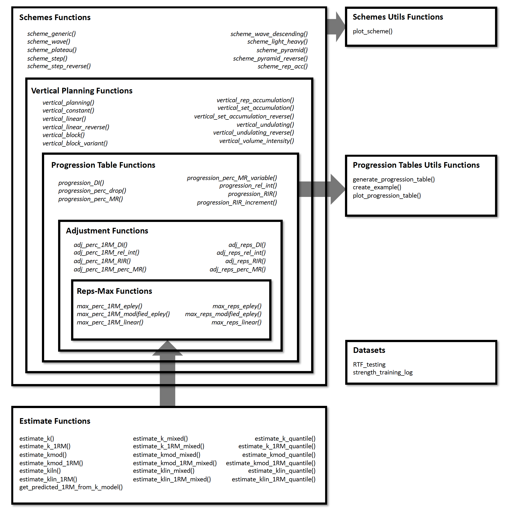

<!-- README.md is generated from README.Rmd. Please edit that file -->

```{r, include = FALSE}
knitr::opts_chunk$set(
  collapse = TRUE,
  comment = "#>",
  fig.path = "man/figures/README-",
  out.width = "100%",
  message = FALSE,
  warning = FALSE,
  dpi = 200
)

# Set rounding
op <- options()
options(digits = 3)
```

# `{STMr}` Package 

<!-- badges: start -->
[](https://zenodo.org/badge/latestdoi/307629379)
[](https://CRAN.R-project.org/package=STMr)
<!-- badges: end -->

`{STMr}` (short of *Strength Training Manual R-functions*) package is created to help sports scientists and strength coaches estimate strength profiles, create and visualize (percent-based) progression tables and set and rep schemes. Originally `{STMr}` package was created as an internal project/package to help me in writing [Strength Training Manual](https://complementarytraining.net/strength-training-manual-paperback-edition/) Volume 3 book, but it soon became a project in itself. `{STMr}` package is open-source package under MIT License implemented in the R language.

`{STMr}` package can be divided in the following functional units:

-   Reps-Max functions (start with `max_`)
-   adjustment functions (start with `adj_`)
-   wrapper functions `get_reps()` and `get_perc_1RM()` are implemented to combine Reps-Max models as well as progression (adjustment) functions into easy to use format
-   progression functions (start with `progression_`)
-   *vertical planning* functions (start with `vertical_`)
-   *scheme function* (start with `scheme_`)
-   plotting and printing functions: `generate_progression_table()`, `plot_progression_table()`, `plot_scheme()`, and `create_example()`
-   built-in datasets (`strength_training_log` and `RTF_testing`)
-   estimation functions (start with `estimate_`)

Figure below depicts the relationship between `{STMr}` package functional units:

```{r echo=FALSE, out.width='100%'}

```

I will walk you through each of these functional units to demonstrate the simplicity, flexibility, usability, and power of the `{STMr}` package. For more information regarding the logic behind the `{STMr}` package please check the [Load-Exertion Tables And Their Use For Planning](https://complementarytraining.net/load-exertion-tables-and-their-use-for-planning-part-1/) article series.

## Installation

You can install the released version (once released) of `{STMr}` from [CRAN](https://CRAN.R-project.org) with:

``` r
install.packages("STMr")
```

And the development version from [GitHub](https://github.com/) with:

``` r
# install.packages("devtools")
devtools::install_github("mladenjovanovic/STMr")
```

Once installed, you can load `{STMr}` package:

```{r}
require(STMr)
```

## Reps-Max Functions

Reps-Max functions map the relationship between %1RM and maximum number of repetitions (*nRM*, or reps-to-failure; *RTF*). `{STMr}` package comes with three Reps-Max models: (1) Epley's, (2) Modified Epley's, and (3) Linear/Brzycki's. Please refer to [Load-Exertion Tables And Their Use For Planning](https://complementarytraining.net/load-exertion-tables-and-their-use-for-planning-part-1/) article series for more information.

Reps-Max functions start with `max_` and allow you to either predict max %1RM from repetitions (start with `max_perc_1RM_`), or to predict max repetitions (i.e., nRM) from %1RM used (start with `max_reps_`). Each of Reps-Max functions allow you to use different model parameter values. This is very helpful when using individualized profiles to create set and rep schemes (see [Estimation] section).

Let's say I am interested in predicting max %1RM that can be used for doing 5 reps to failure. Here you can see how three different models can be used, together with providing custom parameter values:

```{r}
# Predicting max %1RM to be used for target number of repetitions (to failure)

# ------------------------------------------
# Epley equation
max_perc_1RM_epley(5) # Default k=0.0333
max_perc_1RM_epley(5, k = 0.04)

# ------------------------------------------
# Modified Epley equation
max_perc_1RM_modified_epley(5) # Default kmod=0.0353
max_perc_1RM_modified_epley(5, kmod = 0.05)

# ------------------------------------------
# Linear/Brzycki equation
max_perc_1RM_linear(5) # Default klin=33
max_perc_1RM_linear(5, klin = 36)
```

If I am interested in predicting nRM from %1RM utilized, I can use `max_reps_` family of functions. Here I am interested in estimating max reps when using 85% 1RM:

```{r}
# Predicting reps-to-failure (RTF) or nRM from used %1RM

# ------------------------------------------
# Epley equation
max_reps_epley(0.85) # Default k=0.0333
max_reps_epley(0.85, k = 0.04)

# ------------------------------------------
# Modified Epley equation
max_reps_modified_epley(0.85) # Default kmod=0.0353
max_reps_modified_epley(0.85, kmod = 0.05)

# ------------------------------------------
# Linear/Brzycki's equation
max_reps_linear(0.85) # Default klin=33
max_reps_linear(0.85, klin = 36)
```

Let's make this a bit more eye appealing. Here we have plotted the relationship between max reps (RTF; nRM) on x-axis and max %1RM to be used on y-axis:

```{r}
# install.packages("tidyverse", dependencies = TRUE)
require(tidyverse)

max_reps_relationship <- tibble(Reps = seq(1, 12)) %>%
  mutate(
    Epley = max_perc_1RM_epley(Reps),
    `Modified Epley` = max_perc_1RM_modified_epley(Reps),
    `Linear/Brzycki` = max_perc_1RM_linear(Reps)
  ) %>%
  pivot_longer(cols = 2:4, names_to = "Model", values_to = "%1RM") %>%
  mutate(`%1RM` = `%1RM` * 100)

ggplot(max_reps_relationship, aes(x = Reps, y = `%1RM`, color = Model)) +
  theme_bw() +
  geom_line() + 
  scale_x_continuous(breaks = 1:12)
```

## Adjustment Functions

Reps-Max functions help you map out the relationship between reps-to-failure and %1RM. Luckily, not all sets are taken to the point of failure. `{STMr}` package allows you to *adjust* the %1RM or repetitions using four different methods: (1) Deducted Intensity (DI), (2) Relative Intensity (Rel Int), (3) Reps-In-Reserve (RIR), and (4) Percentage of Maximum Reps (%MR). This is done using the `adj_` family of functions, which apply adjustments to selected Reps-Max function/relationship.

Adjustment method is the main element of the progression table and represents the method for progression (see [Progression] section). Although the adjustment of the %1RM used for the target reps (`adj_perc_1RM_` family of functions) is the most common, you can also adjust the reps for target %1RM (`adj_reps_` family of functions). Default Reps-Max function used across adjustment functions is the `max_perc_1RM_epley()`. User is allowed to provide other Reps-Max function as well as custom model parameter value. This is extremely useful in creating individualized progression tables and set and rep schemes.

Here is how you can use the adjustment functions to adjust %1RM when doing 5 repetitions:

```{r}
# Use 10 perc deducted intensity
adj_perc_1RM_DI(5, adjustment = -0.1)

# Use 90 perc  relative intensity
adj_perc_1RM_rel_int(5, adjustment = 0.9)

# Use 2 reps in reserve
adj_perc_1RM_RIR(5, adjustment = 2)

# Use 70 perc max reps
adj_perc_1RM_perc_MR(5, adjustment = 0.7)
```

In addition to using adjustment, user can use *multiplication factor* (`mfactor` parameter). This is useful for creating *ballistic* schemes. In [Strength Training Manual](https://complementarytraining.net/strength-training-manual-paperback-edition/) I have suggested using factor of 2 for ballistic exercises. 

```{r}
# Use ballistic adjustment (this implies doing half the reps of max reps possible)
# In other words, if I am doing 5 reps, I will use 10RM
adj_perc_1RM_DI(5, mfactor = 2)
```

Using the RIR method, I will show you how you can customize adjustments using different Reps-Max function and custom model parameter value: 

```{r}
# Use Linear model
adj_perc_1RM_RIR(5, max_perc_1RM_func = max_perc_1RM_linear, adjustment = 2)

# Use Modifed Epley's equation with a custom parameter values
adj_perc_1RM_RIR(
  5,
  max_perc_1RM_func = max_perc_1RM_modified_epley,
  adjustment = 2,
  kmod = 0.06
)
```

Although I will show you simpler solution to this (see [Progression] section), here is how you can create simple RIR adjustment table:

```{r}
# install.packages("knitr", dependencies = TRUE)
require(knitr)

at <- expand_grid(Reps = 1:5, RIR = 0:4) %>%
  mutate(
    `%1RM` = adj_perc_1RM_RIR(
      reps = Reps,
      adjustment = RIR,
      max_perc_1RM_func = max_perc_1RM_linear,
      klin = 36
    ),
    `%1RM` = round(100 * `%1RM`, 0),
    RIR = paste0(RIR, "RIR")
  ) %>%
  pivot_wider(names_from = RIR, values_from = `%1RM`)

kable(at)
```

### Wrapper Functions

As you noticed, adjustment functions utilize Reps-Max function as parameter and forwards custom model parameter value to it (or default if custom not provided). *Wrapper* functions simplify this process. `{STMr}` package implements two wrapper functions: `get_perc_1RM()` and `get_reps()`:

```{r}
get_perc_1RM(5, method = "RelInt", model = "linear", adjustment = 0.8)

get_perc_1RM(5, method = "%MR", model = "linear", adjustment = 0.8, klin = 36)

get_reps(0.85, method = "RIR", model = "modified epley", adjustment = 2, kmod = 0.035)
```

## Progression

Progressions (or progression tables) represent implemented adjustments in a systematic and organized manner across *progression steps* and scheme *volume types* (intensive, normal, and extensive). Please refer to [Strength Training Manual](https://complementarytraining.net/strength-training-manual-paperback-edition/) book and [Load-Exertion Tables And Their Use For Planning](https://complementarytraining.net/load-exertion-tables-and-their-use-for-planning-part-1/) article series for more information about progression tables.

`{STMr}` package has multiple progressions implemented and they all start with `progression_`. Progression functions also allow user to utilize different Reps-Max function (default is `max_perc_1RM_epley()`) and provide custom model parameter value. This modular and flexible feature allows for easier generation of individualized progression tables, as well as set and rep schemes.

Here is an example using *Constant RIR Increment Progression* using 5 repetitions and -3, -2, -1, and 0 progression steps using "normal" volume. Please note that progression steps move backwards from the Reps-Max relationship, indicated as step 0.

```{r}
progression_RIR(5, step = c(-3, -2, -1, 0), volume = "normal")
```

The output of `progression_` functions is a `list` with two elements: (1) `adjustment`, and (2) `perc_1RM`. You can use this directly, but `progression_` function is most often used within `scheme_` functions (see [Set and Rep Schemes] section). 

Easier way to create progression table across different types (grinding, ballistic), volumes, rep ranges, and progression steps is to use `generate_progression_table()` function:

```{r}
pt <- generate_progression_table(progression_RIR)

head(pt)
```

The default `mfactor` for the ballistic progression table is equal to 2.

Even better approach would be to plot progression table:

```{r}
plot_progression_table(progression_RIR, signif_digits = 2)
```

If you are interested in plotting the adjustments used, use:

```{r}
plot_progression_table(progression_RIR, plot = "adjustment")
```

`progression_RIR()` allows you to use custom progression increments as well as volume increments:

```{r}
plot_progression_table(
  progression_RIR,
  plot = "adjustment",
  step_increment = 1,
  volume_increment = 2
)
```

Here is another example using *Perc Drop* progression table and Linear/Brzycki's model:

```{r}
plot_progression_table(
  progression_perc_drop,
  max_perc_1RM_func = max_perc_1RM_linear,
  klin = 36,
  type = "grinding",
  reps = 1:20,
  signif_digits = 2
)
```

Here are the adjustments used in the *Perc Drop* progression table (deducted %1RM):

```{r}
plot_progression_table(
  progression_perc_drop,
  plot = "adjustment", adjustment_multiplier = 100,
  max_perc_1RM_func = max_perc_1RM_linear,
  klin = 36,
  type = "grinding",
  reps = 1:20,
  signif_digits = 2
)
```

Another useful feature implemented in `{STMr}` package is a `create_example()` function to quickly generate strength training program example. I will use `progression_perc_MR_variable()` in this example:

```{r}
example <- create_example(progression_perc_MR_variable, reps = c(5, 10), type = "grinding")

kable(example)
```

 `{STMr}` package have the following progression tables implemented: `progression_DI()`, `progression_perc_drop()`, `progression_perc_MR()`, `progression_perc_MR_variable()`, `progression_rel_int()`, `progression_RIR()`, and `progression_RIR_increment()`. You can use aforementioned functions to explore these progression tables, and build your own. Please refer to [Load-Exertion Tables And Their Use For Planning](https://complementarytraining.net/load-exertion-tables-and-their-use-for-planning-part-1/) article series for more information about these progression tables.
 
## Vertical Planning

Vertical Planning represents another layer in building set and rep schemes and it revolves around changes or progressions across time. This involves changes to repetitions, progression steps, number of sets and so forth. Please refer to [Strength Training Manual](https://complementarytraining.net/strength-training-manual-paperback-edition/) book for thorough information about the Vertical Planning. Vertical Planning functions in `{STMr}` package begin with `vertical_`.

Here is an example involving *constant* variant of Vertical Planning:

```{r}
vertical_constant(reps = c(5, 5, 5))
```

As can be seen from the code output, this Vertical Planning involves keeping the constant repetitions and decreasing progression steps. Let's use *linear* Vertical Planning:

```{r}
vertical_linear(reps = c(10, 10, 10), reps_change = c(0, -2, -4))
```

Most of these Vertical Planning functionalities can be achieved with the *generic* Vertical Planning function `vertical_planning()`. As can be seen from the output, result of the Vertical Planning functions is a simple `data.frame` with three columns: (1) `reps`, (2) `index`, and (3) `step`. Usability of Vertical Planning functions is mostly visible at the next layer of prescription: *schemes* (see [Set and Rep Schemes] section).

`{STMr}` currently features the following Vertical Planning functions: `vertical_planning()`, `vertical_constant()`, `vertical_linear()`, `vertical_linear_reverse()`, `vertical_block()`, `vertical_block_variant()`, `vertical_rep_accumulation()`, `vertical_set_accumulation()`, `vertical_set_accumulation_reverse()`, `vertical_undulating()`, `vertical_undulating_reverse()`, `vertical_volume_intensity()`.

## Set and Rep Schemes

Set and rep schemes are the highest layer in `{STMr}` package, since they utilize Reps-Max model, adjustment method, progression table, and vertical planning. `{STMr}` package is built to follow this *modular* approach, which makes is extensible and flexible. 

Set and rep schemes are implemented using the functions that begin with `scheme_`. Here is an example for the Wave Set and Rep Scheme (for more information about various set and rep schemes please refer to [Strength Training Manual](https://complementarytraining.net/strength-training-manual-paperback-edition/) book):

```{r}
# Wave set and rep scheme
scheme <- scheme_wave(
  reps = c(10, 8, 6, 10, 8, 6),
  # Adjusting sets to use lower %1RM (RIR Inc method used, so RIR adjusted)
  adjustment = c(4, 2, 0, 6, 4, 2),
  vertical_planning = vertical_linear,
  vertical_planning_control = list(reps_change = c(0, -2, -4)),
  progression_table = progression_RIR_increment,
  progression_table_control = list(volume = "extensive")
)

head(scheme)
```

Set and rep scheme functions offers you the ability to utilize different vertical planning (using the `vertical_planning` argument, as well as `vertical_planning_control` to forward extra parameters to the vertical planning function), progression table (using the `progression_table` argument, as well as `progression_table_control` to forward extra parameters, including Reps-Max function), and extra adjustments to the reps utilized. Please note that the adjustment utilized depends on the progression table selected (i.e., if using RIR Increment, adjustment will be RIR).

The output of the `scheme_` functions is a simple `data.frame` with following columns: (1) `reps`, (2) `index`, (3) `step`, (4) `adjustment`, and (5) `perc_1RM`. Plotting the scheme is a better way to comprehend it:

```{r}
plot_scheme(scheme)
```

In the next example I will utilize different progression table and progression steps, as well as Linear/Brzycki's Reps-Max model with a custom model parameter value:

```{r}
# Wave set and rep scheme
scheme <- scheme_wave(
  reps = c(10, 8, 6, 10, 8, 6),
  # Since the default Wave Loading adjustments assume RIR progression table,
  # we need to set it to zero
  adjustment = 0,
  vertical_planning = vertical_planning, # Generic function
  vertical_planning_control = list(reps_change = c(0, -2, -4, -5), step = c(-6, -4, -2, 0)),
  progression_table = progression_DI,
  progression_table_control = list(
    volume = "intensive",
    max_perc_1RM_func = max_perc_1RM_linear,
    klin = 36
  )
)

plot_scheme(scheme, adjustment_multiplier = 100)
```

This scheme would be pretty impossible to do, since I am using the *intensive* variant of the Deducted Intensity progression, but in this case I have 3 heavy sets. Here is the Deducted Intensity progression table (with -2.5% decrement across volume types and progression steps):

```{r}
plot_progression_table(
  progression_DI,
  max_perc_1RM_func = max_perc_1RM_linear,
  klin = 36,
  type = "grinding",
  reps = 1:20,
  signif_digits = 2
)
```

```{r}
plot_progression_table(
  progression_DI,
  plot = "adjustment", adjustment_multiplier =  100,
  max_perc_1RM_func = max_perc_1RM_linear,
  klin = 36,
  type = "grinding",
  reps = 1:20,
  signif_digits = 2
)
```

To make the Waves Loading scheme in the above example doable, I can apply additional adjustments to make sets easier. Since I am using Deducted Intensity, adjustments will be in %1RM:

```{r}
# Wave set and rep scheme
scheme <- scheme_wave(
  reps = c(10, 8, 6, 10, 8, 6),
  adjustment = c(-15, -10, -5, -10, -5, 0) / 100,
  vertical_planning = vertical_planning, # Generic function
  vertical_planning_control = list(reps_change = c(0, -2, -4, -5), step = c(-6, -4, -2, 0)),
  progression_table = progression_DI,
  progression_table_control = list(
    volume = "intensive",
    max_perc_1RM_func = max_perc_1RM_linear,
    klin = 36
  )
)

plot_scheme(scheme, adjustment_multiplier = 100)
```

The `scheme_` functions afford you great flexibility in designing set and rep schemes. The following set and rep schemes are implemented in `{STMr}` package: `scheme_generic()`, `scheme_wave()`, `scheme_plateau()`, `scheme_step()`, `scheme_step_reverse()`, `scheme_wave_descending()`, `scheme_light_heavy()`, `scheme_pyramid()`, `scheme_pyramid_reverse()`, `scheme_rep_acc()`. 

## Estimation

`{STMr}` package offers very flexible and customizable approach to percent-based strength prescription. As explained in the previous examples, one can use three models of Reps-Max relationship (or write additional implementation) and apply custom model parameter values (i.e., `k`, `kmod`, and `klin` for Epley's, Modified Epley's, and Linear/Brzycki's models respectively). In addition to providing custom model parameter values, `{STMr}` package offers function to estimate these parameter values. 

Before introducing the `estimate_` family of functions, let's introduce built-in datasets that we are going to use. The first dataset is the RTF testing:

```{r}
data(RTF_testing)

head(RTF_testing)
```

This dataset contains reps-to-failure tests for `r length(unique(RTF_testing$Athlete))` athletes, their 1RMs and RTF sets using 90, 80, and 70% 1RM. 

The next dataset is strength training log:

```{r}
data(strength_training_log)

head(strength_training_log)
```

This dataset contains strength training log for a single athlete and single exercise performed in the training program. Strength training program involves doing two strength training sessions, over 12 week (4 phases of 3 weeks each). Session A involves linear wave-loading pattern starting with 2x12/10/8 reps and reaching 2x8/6/4 reps. Session B involves constant wave-loading pattern using 2x3/2/1. This dataset contains weight being used, as well as estimated/perceived reps-in-reserve (eRIR), which represent subjective rating of the proximity to failure. 

`{STMr}` package has three types of estimation functions: (1) simple estimation functions, (2) mixed-effect estimation functions, and (3) quantile estimation functions. Each of these three types of estimation functions allow you to work with (1) %1RM and repetitions to estimate single parameter (i.e., `k`, `kmod`, or `klin` parameters for Epley's, Modified Epley's, and Linear/Brzycki's models respectively), and (2) absolute weight and repetitions, which in addition to estimating model parameter value estimates 1RM. This represent novel technique in sports science, yet to be validated (paper preparation currently ongoing). In the next section I will walk you through each of these, but for more information please refer to [Load-Exertion Tables And Their Use For Planning](https://complementarytraining.net/load-exertion-tables-and-their-use-for-planning-part-1/) article series.

### Simple estimation

To demonstrate simple profile estimation I will use `RTF_testing` dataset. The figure below depicts maximum number of repetitions performed against both absolute (or raw) and relative weights (using %1RM). 

```{r}
# install.packages("patchwork", dependencies = TRUE)
require(patchwork)

gg_absolute <- ggplot(RTF_testing, aes(x = `Real Weight`, y = nRM, color = Athlete)) +
  theme_bw() +
  geom_point(alpha = 0.8) +
  geom_line(alpha = 0.8) +
  xlab("Weight (kg)") +
  theme(legend.position = "none")

gg_relative <- ggplot(RTF_testing, aes(x = `Real %1RM` * 100, y = nRM, color = Athlete)) +
  theme_bw() +
  geom_point(alpha = 0.8) +
  geom_line(alpha = 0.8) +
  xlab("%1RM") +
  ylab(NULL)

gg_absolute + gg_relative + plot_layout(widths = c(1, 1.1))
```

Let's use *Athlete B* from RTF testing dataset to estimate individual model parameter values for Epley's, Modified Epley's, and Linear/Brzycki's models. 

```{r}
athlete_rtf <- RTF_testing %>%
  filter(Athlete == "Athlete B")

# Estimate Epley's model
m1 <- estimate_k(
  perc_1RM = athlete_rtf$`Real %1RM`,
  reps = athlete_rtf$nRM
)

coef(m1)

# Estimate Modifed Epley's model
m2 <- estimate_kmod(
  perc_1RM = athlete_rtf$`Real %1RM`,
  reps = athlete_rtf$nRM
)

coef(m2)

# Estimate Linear/Brzycki's model
m3 <- estimate_klin(
  perc_1RM = athlete_rtf$`Real %1RM`,
  reps = athlete_rtf$nRM
)

coef(m3)
```

These simple estimation functions return the `nls` object, since `nls()` function is used to estimate model parameter values. You can also use the `...` feature of the simple estimation function to forward extra arguments to `nls()` function.

Estimate functions also allow you to use *reverse* statistical model (using `reverse = TRUE` argument), where predictor is number of reps (i.e., nRM), and target variable is %1RM. 

Estimate functions offer various observation weighting options. Options are 'none', 'reps', 'load', 'eRIR', 'reps x load', 'reps x eRIR', 'load x eRIR', and 'reps x load x eRIR' and are set using the `weighted =` argument. 

Novel technique implemented into `{STMr}` is estimation of both 1RM and model parameter value from absolute weights, rather than from %1RM for which you need known 1RM:

```{r}
# Estimate Epley's model
m1 <- estimate_k_1RM(
  weight = athlete_rtf$`Real Weight`,
  reps = athlete_rtf$nRM
)

coef(m1)

# Since Epley's model estimated 0RM and NOT 1RM, use
# the following function to get 1RM
get_predicted_1RM_from_k_model(m1)

# Estimate Modifed Epley's model
m2 <- estimate_kmod_1RM(
  weight = athlete_rtf$`Real Weight`,
  reps = athlete_rtf$nRM
)

coef(m2)

# Estimate Linear/Brzycki's model
m3 <- estimate_klin_1RM(
  weight = athlete_rtf$`Real Weight`,
  reps = athlete_rtf$nRM
)

coef(m3)
```

This novel technique allows for *embedded testing* (please refer to [Strength Training Manual](https://complementarytraining.net/strength-training-manual-paperback-edition/) and [Load-Exertion Tables And Their Use For Planning](https://complementarytraining.net/load-exertion-tables-and-their-use-for-planning-part-1/) article series for more information) using the strength training log data. In the case where sets are not taken to failure, one can also utilize subjective rating of perceived/estimated RIR (`eRIR` argument). This technique will be applied to log analysis in the [Quantile estimation] section. 

### Mixed-effect estimation

The simple estimation function allow for the estimation for a single individual. Simple estimation can also be used for *pooled* analysis (i.e., all athletes and/or exercises pooled together) with %1RM to get the *generic* or *average* model parameter value. Unfortunately, this will not work with the absolute weights as predictors, hence the need to *normalize* the predictors using relative weight or %1RM. 

Here is an example of pooled profile estimation using the `RTF_testing` dataset and Modified Epley's model:

```{r}
m_pooled <- estimate_kmod(
  perc_1RM = RTF_testing$`Real %1RM`,
  reps = RTF_testing$nRM,
  # Use weighting
  weighted = "reps x load"
)

coef(m_pooled)

pred_df <- data.frame(perc_1RM = seq(0.65, 1, length.out = 100)) %>%
  mutate(nRM = max_reps_modified_epley(perc_1RM = perc_1RM, kmod = coef(m_pooled)))

ggplot(RTF_testing, aes(x = `Real %1RM` * 100, y = nRM)) +
  theme_bw() +
  geom_point(aes(color = Athlete), alpha = 0.8) +
  geom_line(aes(color = Athlete), alpha = 0.8) +
  xlab("%1RM") +
  geom_line(data = pred_df, aes(x = perc_1RM * 100, y = nRM), size = 1.5, alpha = 0.8)
```

When analyzing multiple individuals, particularly when absolute weights are used instead of %1RM, one needs to utilize mixed-effect approach. `{STMr}` package implements non-linear mixed-effect model using the `nlme()` function from the `{nlme}` package. Mixed-effects estimation functions in `{STMr}` package end with `_mixed`. You can also use the `...` feature of the mixed-effects estimation functions to forward extra arguments to `nlme()` function.

Here is how to perform mixed-effects model using Modified Epley's model and %1RM as predictor:

```{r}
mm1 <- estimate_kmod_mixed(
  athlete = RTF_testing$Athlete,
  perc_1RM = RTF_testing$`Real %1RM`,
  reps = RTF_testing$nRM
)

summary(mm1)

coef(mm1)
```

Please note the difference between *fixed* parameter value of `kmod` estimated using the mixed-effects model (equal to `r round(summary(mm1)$coefficients$fixed, 5)`) and our previous pooled model (equal to `r round(coef(m_pooled), 5)`). 

In addition to estimating fixed parameter value, mixed-effects model also estimates *random* parameter values (i.e., individual athlete model parameter values). Mixed-effects model can be thought as a combination of pooled model (i.e., fixed effects) and multiple individual models (i.e., random effects). Figure below depicts random effects (i.e., individual predictions), fixed effects (i.e., group predictions; thick line), as well as pooled simple model predictions (dashed thick line):

```{r}
pred_rnd_df <- expand_grid(
  athlete = unique(RTF_testing$Athlete),
  perc_1RM = seq(0.65, 1, length.out = 100)
) %>%
  mutate(nRM = predict(mm1, newdata = data.frame(athlete = athlete, perc_1RM = perc_1RM)))

pred_fix_df <- data.frame(perc_1RM = seq(0.65, 1, length.out = 100)) %>%
  mutate(nRM = max_reps_modified_epley(perc_1RM = perc_1RM, kmod = summary(mm1)$coefficients$fixed))

gg <- ggplot(RTF_testing, aes(x = `Real %1RM` * 100, y = nRM)) +
  theme_bw() +
  geom_point(aes(color = Athlete), alpha = 0.8) +
  geom_line(data = pred_rnd_df, aes(x = perc_1RM * 100, y = nRM, color = athlete), alpha = 0.8) +
  geom_line(data = pred_fix_df, aes(x = perc_1RM * 100, y = nRM), alpha = 0.8, size = 1.5) +
  geom_line(data = pred_df, aes(x = perc_1RM * 100, y = nRM), size = 1.5, alpha = 0.8, linetype = "dashed") +
  xlab("%1RM")
gg
```

`{STMr}` package also implements mixed-effect models that utilize absolute weight values. As alluded previously, this is novel technique that besides estimating Reps-Max profile, also estimates 1RM. Here is how to perform mixed-effects Linear/Brzycki's model using absolute weights:

```{r}
mm2 <- estimate_klin_1RM_mixed(
  athlete = RTF_testing$Athlete,
  weight = RTF_testing$`Real Weight`,
  reps = RTF_testing$nRM
)

summary(mm2)

coef(mm2)
```

Here is how this looks graphically:

```{r}
pred_rnd_df <- expand_grid(
  athlete = unique(RTF_testing$Athlete),
  weight = seq(
    min(RTF_testing$`Real Weight`) * 0.9,
    max(RTF_testing$`Real Weight`) * 1.1,
    length.out = 100
  )
) %>%
  mutate(nRM = predict(mm2, newdata = data.frame(athlete = athlete, weight = weight))) %>%
  filter(nRM >= 1)


gg <- ggplot(RTF_testing, aes(x = `Real Weight`, y = nRM)) +
  theme_bw() +
  geom_point(aes(color = Athlete), alpha = 0.8) +
  geom_line(data = pred_rnd_df, aes(x = weight, y = nRM, color = athlete), alpha = 0.8) +
  xlab("Weight (kg)")
gg
```

Mixed-effects functions implemented in `{STMr}` package allows you to set-up random parameters using `random=` function argument. In the previous example both 1RM and `klin` parameters are treated as random, but you can make `klin` fixed: 

```{r}
mm3 <- estimate_klin_1RM_mixed(
  athlete = RTF_testing$Athlete,
  weight = RTF_testing$`Real Weight`,
  reps = RTF_testing$nRM,
  random = oneRM ~ 1
)

summary(mm3)

coef(mm3)
```

It is easier to grasp this graphically:

```{r}
pred_rnd_df <- expand_grid(
  athlete = unique(RTF_testing$Athlete),
  weight = seq(
    min(RTF_testing$`Real Weight`) * 0.9,
    max(RTF_testing$`Real Weight`) * 1.1,
    length.out = 100
  )
) %>%
  mutate(nRM = predict(mm3, newdata = data.frame(athlete = athlete, weight = weight))) %>%
  filter(nRM >= 1)


gg <- ggplot(RTF_testing, aes(x = `Real Weight`, y = nRM)) +
  theme_bw() +
  geom_point(aes(color = Athlete), alpha = 0.8) +
  geom_line(data = pred_rnd_df, aes(x = weight, y = nRM, color = athlete), alpha = 0.8) +
  xlab("Weight (kg)")
gg
```

In my opinion this doesn't make much sense. If you are interested in estimating group or *generic* `klin` (or `k` or `kmod`) model parameter values, use fixed estimates, but allow it to vary (i.e. to be random effect). Estimated fixed `klin` value from random 1RM and random `klin` model is equal to `r round(summary(mm2)$coefficients$fixed[[1]], 2)`, where with the above fixed `klin` and random 1RM it is equal to `r round(summary(mm3)$coefficients$fixed[[1]], 2)`. Regardless of your statistical modeling preference, `{STMr}` package allows you implementation of each. 

### Quantile estimation

So far we have estimated Reps-Max profiles using sets to failure. This approach demands designated *testing* session(s). But what if we could estimate Reps-Max profiles as well as 1RMs from training log data? This would allow "embedded" testing, since we would not need designated testing sessions or sets, but we could use normal training log data. 

When sets are not taken to failure, one way to estimate max reps that can be performed is to utilize subjective rating of *perceived reps-in-reserve* (pRIR or eRIR). For example, if I perform 100kg for 5 reps on the bench press and I rate it with 2pRIR, I can assume that is 7RM load (i.e., 5 reps + 2pRIR). 

`strength_training_log` dataset contains both reps performed as well as eRIR values, including weight used. High eRIR values (>5eRIR) are treated as missing-data (i.e., unreliable). Here is the pooled plot from 12 weeks of training log data for a single exercise: 

```{r}
gg <- ggplot(strength_training_log) +
  theme_bw() +
  geom_jitter(
    aes(x = weight, y = reps + eRIR),
    size = 2,
    shape = 1,
    width = 0.2,
    height = 0.2,
    alpha = 0.8
  ) +
  xlab("Weight (kg)")

gg
```

We are interested in finding both the "best" and "worst" profiles (as well as estimated 1RMs). To achieve this, we will utilize *quantile non-linear regression*. This quantile non-linear estimation is implemented in `{STMr}` package using the `nlrq()` function from the `{quantreg}` package. Quantile estimation functions ends with `_quantile`. You can also use the `...` feature of the quantile estimation functions to forward extra arguments to `nlrq()` function.

For the "best" performance profile we can use 0.95 quantile, and for "worst" we can use "0.05" quantile. I will utilize Linear/Brzycki's model. For more information please refer to [Load-Exertion Tables And Their Use For Planning](https://complementarytraining.net/load-exertion-tables-and-their-use-for-planning-part-1/) article series. 

```{r}
mq_best <- estimate_klin_1RM_quantile(
  weight = strength_training_log$weight,
  reps = strength_training_log$reps,
  eRIR = strength_training_log$eRIR,
  tau = 0.95
)

summary(mq_best)
coef(mq_best)

mq_worst <- estimate_klin_1RM_quantile(
  weight = strength_training_log$weight,
  reps = strength_training_log$reps,
  eRIR = strength_training_log$eRIR,
  tau = 0.05
)

summary(mq_worst)
coef(mq_worst)
```

Graphically, these profiles look like this:

```{r}
pred_df_best <- tibble(weight = seq(60, 120, length.out = 100)) %>%
  mutate(nRM = predict(mq_best, newdata = data.frame(weight = weight))) %>%
  filter(nRM >= 1)

pred_df_worst <- tibble(weight = seq(60, 120, length.out = 100)) %>%
  mutate(nRM = predict(mq_worst, newdata = data.frame(weight = weight))) %>%
  filter(nRM >= 1)

gg +
  geom_line(data = pred_df_best, aes(x = weight, y = nRM)) +
  geom_line(data = pred_df_worst, aes(x = weight, y = nRM), linetype = "dashed")
```

In this example we have used all 12 weeks of strength training log data (i.e., pooled). We can perform some type of "rolling" analysis to get ideas of trends, particularly the estimated 1RM trend across time. In the following example, I am using rolling 3 weeks estimation of the "best" and "worst" 1RM:

```{r}
estimate_1RM <- function(df_log, week_start, week_end) {
  df <- df_log %>%
    mutate(index = (phase - 1) * 3 + week) %>%
    filter(index >= week_start & index <= week_end)

  mq_best <- estimate_klin_1RM_quantile(
    weight = df$weight,
    reps = df$reps,
    eRIR = df$eRIR,
    tau = 0.95
  )

  mq_worst <- estimate_klin_1RM_quantile(
    weight = df$weight,
    reps = df$reps,
    eRIR = df$eRIR,
    tau = 0.05
  )

  tibble(best = coef(mq_best)[[2]], worst = coef(mq_worst)[[2]])
}

rolling_weeks <- tibble(week_start = seq(1, 10)) %>%
  mutate(week_end = week_start + 2) %>%
  rowwise() %>%
  mutate(estimate_1RM(strength_training_log, week_start, week_end))

ggplot(rolling_weeks, aes(x = week_end)) +
  theme_bw() +
  geom_line(aes(y = best)) +
  geom_line(aes(y = worst), linetype = "dashed") +
  scale_x_continuous(breaks = 1:12) +
  xlab("Week") +
  ylab("Estimated 1RM (kg)")
```

This analysis represents novel technique and the time will tell how valid is it and how to interpret it correctly. But at least we have very powerful, transparent, and flexible open-source tool: `{STMr}` package.

## How to cite `{STMr}`

If you are using `{STMr}` package in your publications, please use the following citation:

```{r}
citation("STMr")
```

If you plan using estimation models in your commercial or non-commercial products, please contact me at my email: `coach.mladen.jovanovic` \@ `gmail.com`

```{r echo=FALSE}
options(op)
```
