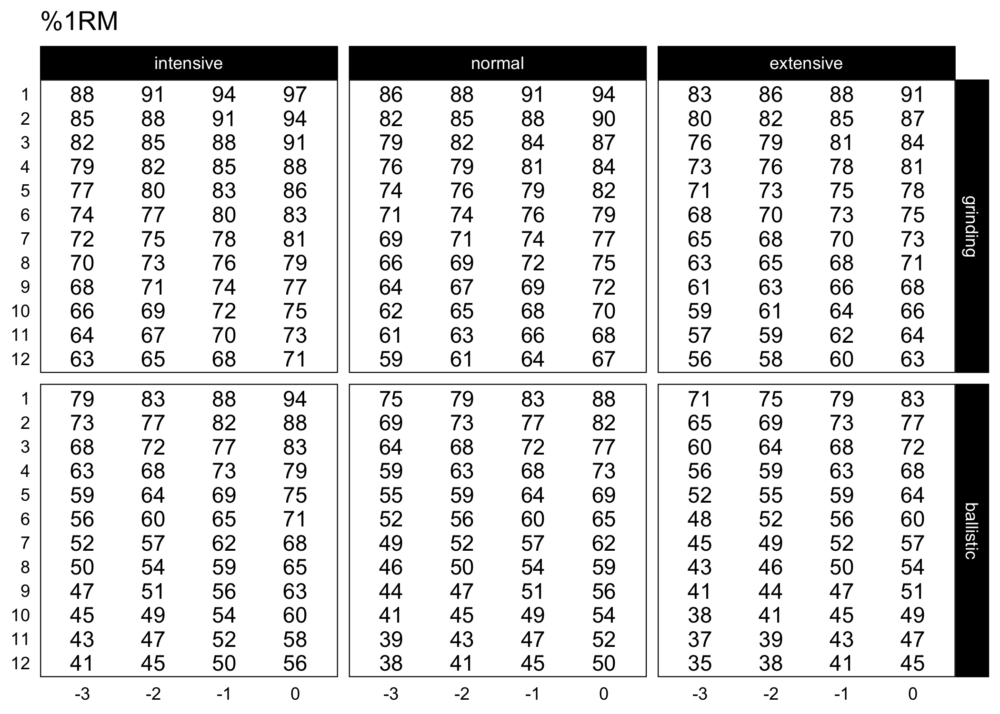
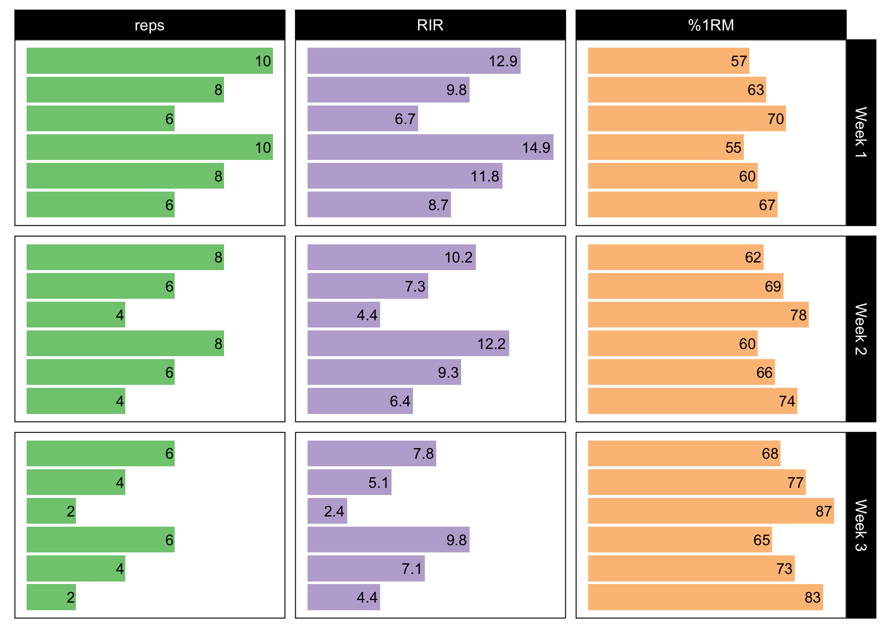
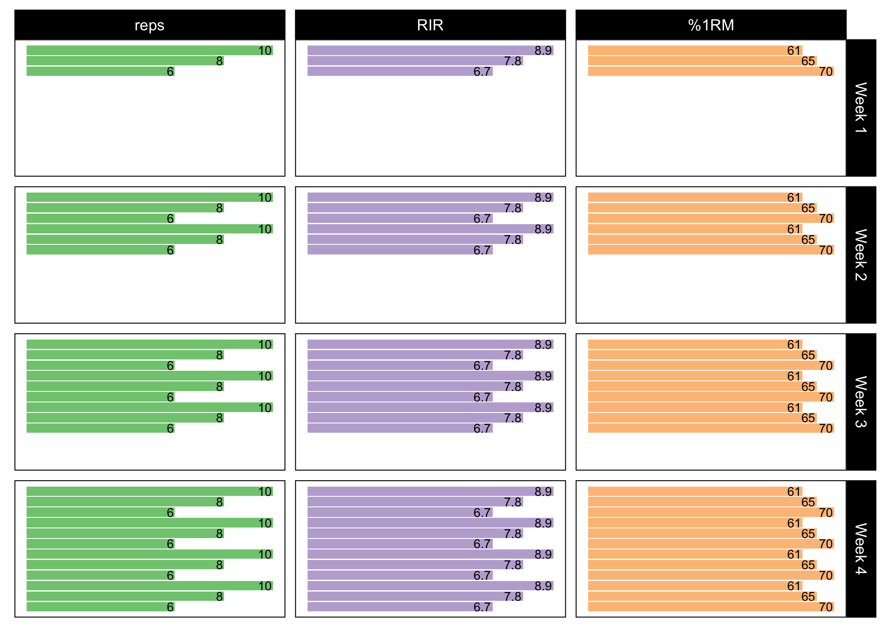

<!-- README.md is generated from README.Rmd. Please edit that file -->

# STM 

<!-- badges: start -->

[](https://zenodo.org/badge/latestdoi/307629379)
[](https://CRAN.R-project.org/package=STM)
<!-- badges: end -->

The goal of `STM` is to provide the readers of the [Strength Training
Manual](https://amzn.to/3owbBr6) a list of functions to help them
re-create set and rep schemes as well as to create their own in
reproducible and open-source environment.

## Installation

You can install the released version (once released) of `STM` from
[CRAN](https://CRAN.R-project.org) with:

``` r
install.packages("STM")
```

And the development version from [GitHub](https://github.com/) with:

``` r
# install.packages("devtools")
devtools::install_github("mladenjovanovic/STM")
```

## Examples

This is a quick example, more are coming….

### Progression tables

[Strength Training Manual](https://amzn.to/3owbBr6) comes with two
progression table implemented in `progression_RIR_increment()` and
`progression_perc_drop()` functions, although there are other variants
(and you can easily make your own).

Here is the **RIR Increment** progression table:

``` r
# Load STM package
require(STM)

plot_progression_table(progression_RIR_increment, signif_digits = 2)
```



And the **Perc Drop** progression table:

``` r
plot_progression_table(progression_perc_drop, signif_digits = 2)
```



### Set and Rep schemes

[Strength Training Manual](https://amzn.to/3owbBr6) comes with more than
2,000 set and rep schemes. `STM` package allows re-creation of those
schemes, but also creation of custom ones.

Here is an example for the Wave Set and Rep Scheme

``` r
# Wave set and rep scheme
scheme <- scheme_wave(
  reps = c(10, 8, 6, 10, 8, 6),
  # Adjusting sets to use lower %1RM (RIR Inc method used, so RIR adjusted)
  adjustment = c(4, 2, 0, 6, 4, 2),
  vertical_planning = vertical_linear,
  vertical_planning_control = list(reps_change = c(0, -2, -4)),
  progression_table = progression_RIR_increment,
  progression_table_control = list(volume = "extensive")
)

plot_scheme(scheme)
```


