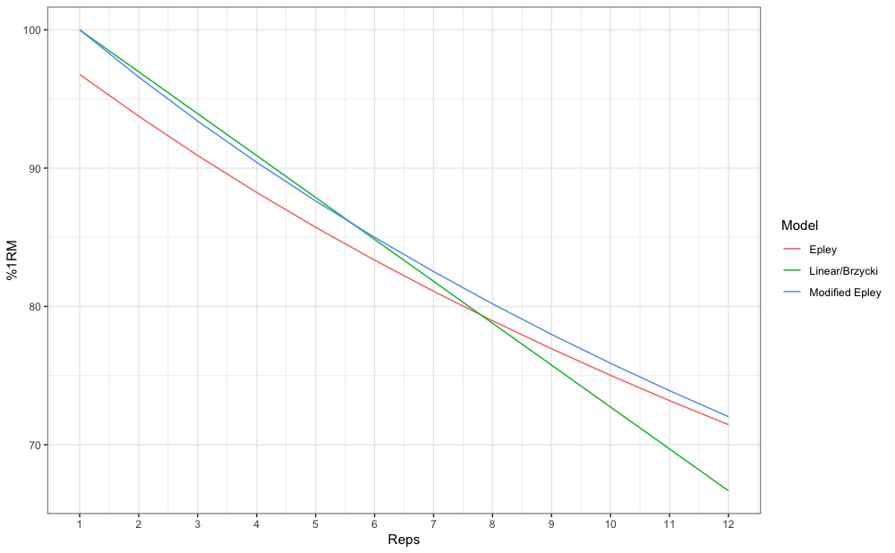
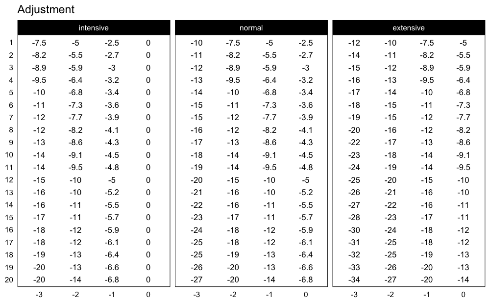
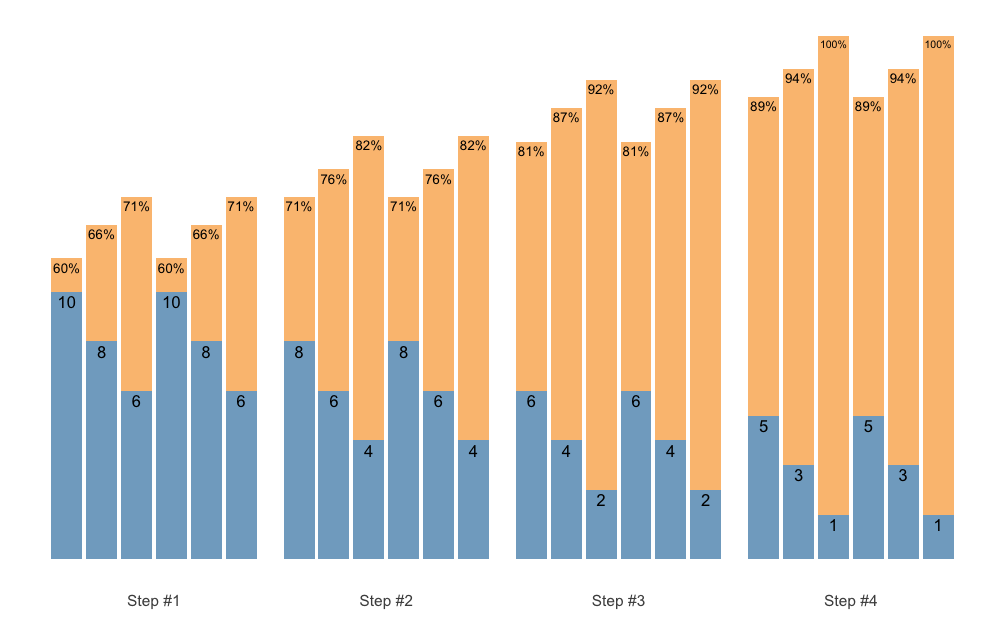
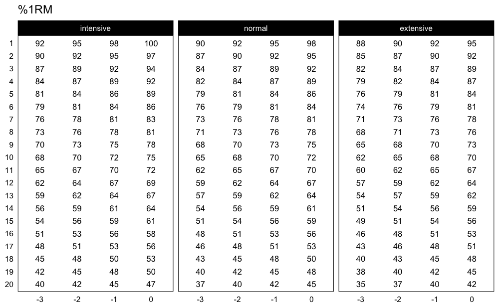
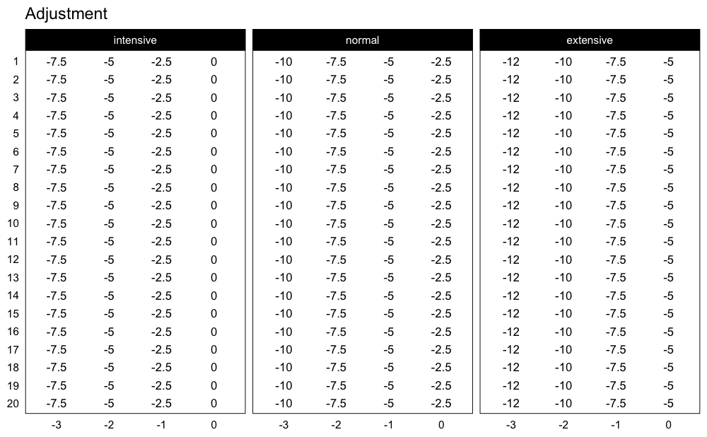
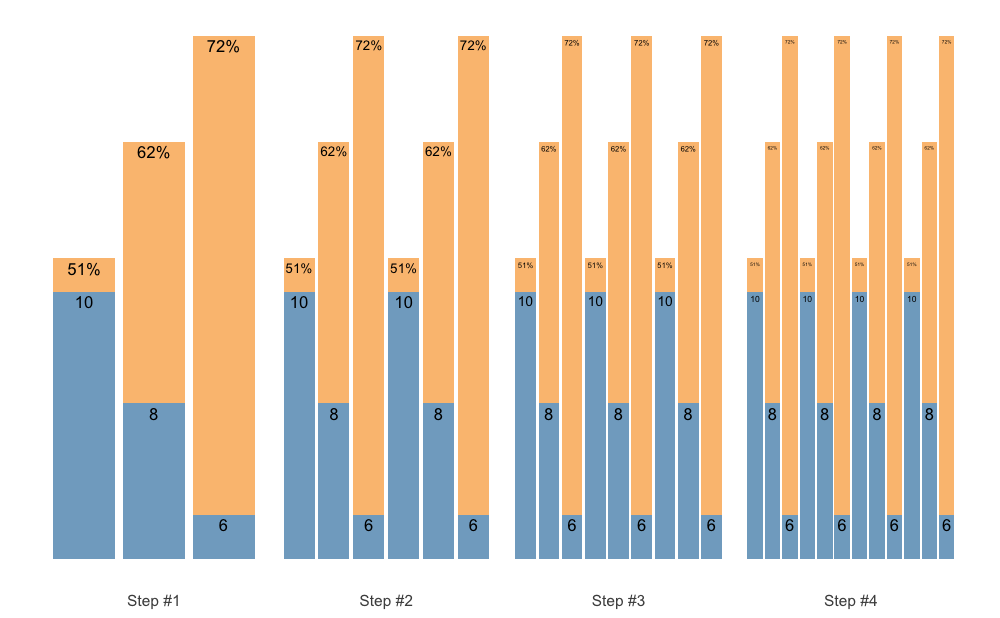
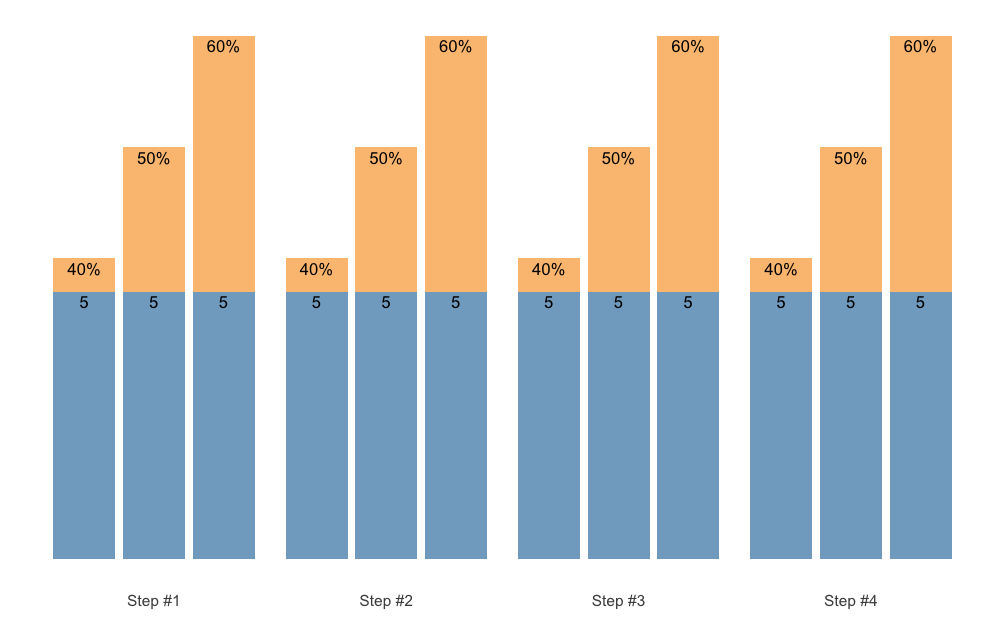
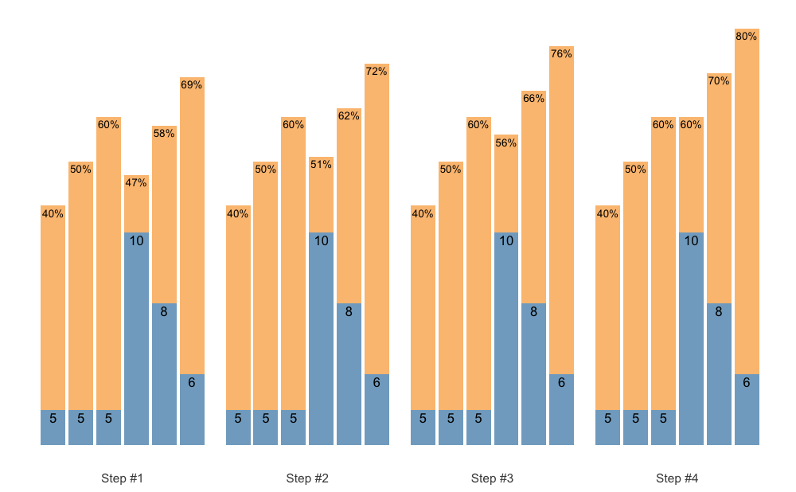
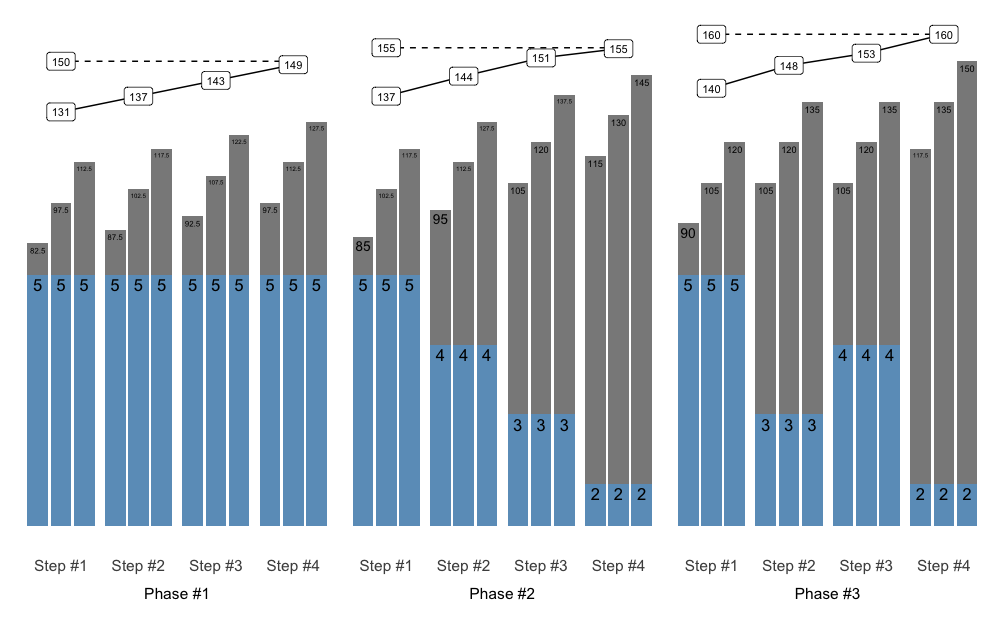
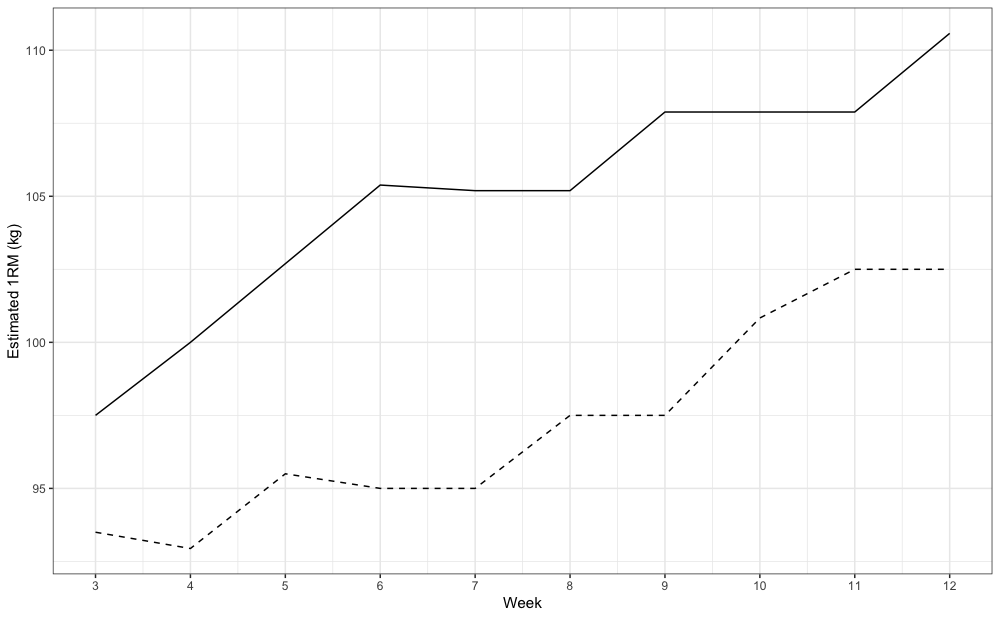

# `{STMr}` Package

**Table of Contents**

*This is longer README file, so here is the TOC for easier jumping to
topics*

- [Introduction](#introduction)
- [Installation](#installation)
- [Reps-Max Functions](#reps-max-functions)
- [Adjustment Functions](#adjustment-functions)
- [Progressions](#progressions)
- [Vertical Planning](#vertical-planning)
- [Set and Rep Schemes](#set-and-rep-schemes)
- [Release](#release)
- [Estimation](#estimation)
- [Scheme plotting tips](#scheme-plotting-tips)
- [Further information](#further-information)
- [How to cite `{STMr}`](#how-to-cite-stmr)

## Introduction

[STMr](https://mladenjovanovic.github.io/STMr/) (short of *Strength
Training Manual R-functions*) package is created to help sports
scientists and strength coaches estimate strength profiles, create and
visualize (percent-based) progression tables and set and rep schemes.
Originally [STMr](https://mladenjovanovic.github.io/STMr/) package was
created as an internal project/package to help me in writing [Strength
Training
Manual](https://complementarytraining.com/strength-training-manual-paperback-edition/)
Volume 3 book, but it soon became a project in itself.
[STMr](https://mladenjovanovic.github.io/STMr/) package is open-source
package under MIT License implemented in the R language.

[STMr](https://mladenjovanovic.github.io/STMr/) package can be divided
in the following functional units:

- Reps-Max functions (start with `max_`)
- adjustment functions (start with `adj_`)
- wrapper functions
  [`get_reps()`](https://mladenjovanovic.github.io/STMr/reference/get_reps.md)
  and
  [`get_perc_1RM()`](https://mladenjovanovic.github.io/STMr/reference/get_perc_1RM.md)
  are implemented to combine Reps-Max models as well as progression
  (adjustment) functions into easy to use format
- progression functions (start with `progression_`)
- *vertical planning* functions (start with `vertical_`)
- *scheme function* (start with `scheme_`)
- [`release()`](https://mladenjovanovic.github.io/STMr/reference/release.md)
  function for molding multiple back-to-back schemes (i.e., blocks or
  phases)
- plotting and printing functions:
  [`generate_progression_table()`](https://mladenjovanovic.github.io/STMr/reference/progression_table.md),
  [`plot_progression_table()`](https://mladenjovanovic.github.io/STMr/reference/plot_progression_table.md),
  [`plot_scheme()`](https://mladenjovanovic.github.io/STMr/reference/plot_scheme.md)
  (deprecated as of [STMr](https://mladenjovanovic.github.io/STMr/)
  version 0.1.4. Please use S3
  [`plot()`](https://rdrr.io/r/graphics/plot.default.html) method
  instead), and
  [`create_example()`](https://mladenjovanovic.github.io/STMr/reference/create_example.md)
- built-in datasets (`strength_training_log` and `RTF_testing`)
- estimation functions (start with `estimate_`)

Figure below depicts the relationship between
[STMr](https://mladenjovanovic.github.io/STMr/) package functional
units:


I will walk you through each of these functional units to demonstrate
the simplicity, flexibility, usability, and power of the
[STMr](https://mladenjovanovic.github.io/STMr/) package. For more
information regarding the logic behind the
[STMr](https://mladenjovanovic.github.io/STMr/) package please check the
[Load-Exertion Tables And Their Use For
Planning](https://complementarytraining.com/load-exertion-tables-and-their-use-for-planning-part-1/)
article series.

## Installation

You can install the released version (once released) of
[STMr](https://mladenjovanovic.github.io/STMr/) from
[CRAN](https://CRAN.R-project.org) with:

``` r
install.packages("STMr")
```

And the development version from [GitHub](https://github.com/) with:

``` r
# install.packages("devtools")
devtools::install_github("mladenjovanovic/STMr")
```

Once installed, you can load
[STMr](https://mladenjovanovic.github.io/STMr/) package:

``` r
library(STMr)
```

## Reps-Max Functions

Reps-Max functions map the relationship between %1RM and maximum number
of repetitions (*nRM*, *MNR*, or reps-to-failure; *RTF*).
[STMr](https://mladenjovanovic.github.io/STMr/) package comes with three
Reps-Max models: (1) Epley’s, (2) Modified Epley’s, and (3)
Linear/Brzycki’s. Please refer to [Load-Exertion Tables And Their Use
For
Planning](https://complementarytraining.com/load-exertion-tables-and-their-use-for-planning-part-1/)
article series for more information.

Reps-Max functions start with `max_` and allow you to either predict max
%1RM from repetitions (start with `max_perc_1RM_`), or to predict max
repetitions (i.e., nRM) from %1RM used (start with `max_reps_`). Each of
Reps-Max functions allow you to use different model parameter values.
This is very helpful when using individualized profiles to create set
and rep schemes (see [Estimation](#estimation) section).

Let’s say I am interested in predicting max %1RM that can be used for
doing 5 reps to failure. Here you can see how three different models can
be used, together with providing custom parameter values:

``` r
# Predicting max %1RM to be used for target number of repetitions (to failure)

# ------------------------------------------
# Epley equation
max_perc_1RM_epley(5) # Default k=0.0333
#> [1] 0.857
max_perc_1RM_epley(5, k = 0.04)
#> [1] 0.833

# ------------------------------------------
# Modified Epley equation
max_perc_1RM_modified_epley(5) # Default kmod=0.0353
#> [1] 0.876
max_perc_1RM_modified_epley(5, kmod = 0.05)
#> [1] 0.833

# ------------------------------------------
# Linear/Brzycki equation
max_perc_1RM_linear(5) # Default klin=33
#> [1] 0.879
max_perc_1RM_linear(5, klin = 36)
#> [1] 0.889
```

If I am interested in predicting nRM from %1RM utilized, I can use
`max_reps_` family of functions. Here I am interested in estimating max
reps when using 85% 1RM:

``` r
# Predicting reps-to-failure (RTF) or nRM from used %1RM

# ------------------------------------------
# Epley equation
max_reps_epley(0.85) # Default k=0.0333
#> [1] 5.3
max_reps_epley(0.85, k = 0.04)
#> [1] 4.41

# ------------------------------------------
# Modified Epley equation
max_reps_modified_epley(0.85) # Default kmod=0.0353
#> [1] 6
max_reps_modified_epley(0.85, kmod = 0.05)
#> [1] 4.53

# ------------------------------------------
# Linear/Brzycki's equation
max_reps_linear(0.85) # Default klin=33
#> [1] 5.95
max_reps_linear(0.85, klin = 36)
#> [1] 6.4
```

Let’s make this a bit more eye appealing. Here we have plotted the
relationship between max reps (RTF; nRM) on x-axis and max %1RM to be
used on y-axis:

``` r
# install.packages("tidyverse", dependencies = TRUE)
library(tidyverse)

max_reps_relationship <- tibble(Reps = seq(1, 12)) %>%
  mutate(
    Epley = max_perc_1RM_epley(Reps),
    `Modified Epley` = max_perc_1RM_modified_epley(Reps),
    `Linear/Brzycki` = max_perc_1RM_linear(Reps)
  ) %>%
  pivot_longer(cols = 2:4, names_to = "Model", values_to = "%1RM") %>%
  mutate(`%1RM` = `%1RM` * 100)

ggplot(max_reps_relationship, aes(x = Reps, y = `%1RM`, color = Model)) +
  theme_bw() +
  geom_line() +
  xlab("Maximum Number of Reps") +
  scale_x_continuous(breaks = 1:12)
```



## Adjustment Functions

Reps-Max functions help you map out the relationship between
reps-to-failure and %1RM. Luckily, not all sets are taken to the point
of failure. [STMr](https://mladenjovanovic.github.io/STMr/) package
allows you to *adjust* the %1RM or repetitions using four different
methods: (1) Deducted Intensity (DI), (2) Relative Intensity (Rel Int),
(3) Reps-In-Reserve (RIR), and (4) Percentage of Maximum Reps (%MR).
This is done using the `adj_` family of functions, which apply
adjustments to selected Reps-Max function/relationship.

Adjustment method is the main element of the progression table and
represents the method for progression (see \[Progression\] section).
Although the adjustment of the %1RM used for the target reps
(`adj_perc_1RM_` family of functions) is the most common, you can also
adjust the reps for target %1RM (`adj_reps_` family of functions).
Default Reps-Max function used across adjustment functions is the
[`max_perc_1RM_epley()`](https://mladenjovanovic.github.io/STMr/reference/max_perc_1RM.md).
User is allowed to provide other Reps-Max function as well as custom
model parameter value. This is extremely useful in creating
individualized progression tables and set and rep schemes.

Here is how you can use the adjustment functions to adjust %1RM when
doing 5 repetitions:

``` r
# Use 10 perc deducted intensity
adj_perc_1RM_DI(5, adjustment = -0.1)
#> [1] 0.757

# Use 90 perc  relative intensity
adj_perc_1RM_rel_int(5, adjustment = 0.9)
#> [1] 0.772

# Use 2 reps in reserve
adj_perc_1RM_RIR(5, adjustment = 2)
#> [1] 0.811

# Use 70 perc max reps
adj_perc_1RM_perc_MR(5, adjustment = 0.7)
#> [1] 0.808
```

In addition to using adjustment, user can use *multiplication factor*
(`mfactor` parameter). This is useful for creating *ballistic*, as well
as *conservative* schemes. In [Strength Training
Manual](https://complementarytraining.com/strength-training-manual-paperback-edition/)
I have suggested using factor of 2 for ballistic exercises and using
factor of 3 for *control* exercises (implementing holds or various
tempos of execution).

``` r
# Use ballistic adjustment (this implies doing half of the max reps possible)
# In other words, if I am doing 5 reps, I will use 10RM
adj_perc_1RM_DI(5, mfactor = 2)
#> [1] 0.75
```

``` r
# Use conservative adjustment (this implies doing 1/3 of the max reps possible)
# In other words, if I am doing 5 reps, I will use 15RM
adj_perc_1RM_DI(5, mfactor = 3)
#> [1] 0.667
```

Using the RIR method, I will show you how you can customize adjustments
using different Reps-Max function and custom model parameter value:

``` r
# Use Linear model
adj_perc_1RM_RIR(5, max_perc_1RM_func = max_perc_1RM_linear, adjustment = 2)
#> [1] 0.818

# Use Modifed Epley's equation with a custom parameter values
adj_perc_1RM_RIR(
  5,
  max_perc_1RM_func = max_perc_1RM_modified_epley,
  adjustment = 2,
  kmod = 0.06
)
#> [1] 0.735
```

Although I will show you simpler solution to this (see \[Progression\]
section), here is how you can create simple RIR adjustment table:

``` r
# install.packages("knitr", dependencies = TRUE)
library(knitr)

at <- expand_grid(Reps = 1:5, RIR = 0:4) %>%
  mutate(
    `%1RM` = adj_perc_1RM_RIR(
      reps = Reps,
      adjustment = RIR,
      max_perc_1RM_func = max_perc_1RM_linear,
      klin = 36
    ),
    `%1RM` = round(100 * `%1RM`, 0),
    RIR = paste0(RIR, "RIR")
  ) %>%
  pivot_wider(names_from = RIR, values_from = `%1RM`)

kable(at)
```

| Reps | 0RIR | 1RIR | 2RIR | 3RIR | 4RIR |
|-----:|-----:|-----:|-----:|-----:|-----:|
|    1 |  100 |   97 |   94 |   92 |   89 |
|    2 |   97 |   94 |   92 |   89 |   86 |
|    3 |   94 |   92 |   89 |   86 |   83 |
|    4 |   92 |   89 |   86 |   83 |   81 |
|    5 |   89 |   86 |   83 |   81 |   78 |

### Wrapper Functions

As you noticed, adjustment functions utilize Reps-Max function as
parameter and forwards custom model parameter value to it (or default if
custom not provided). *Wrapper* functions simplify this process.
[STMr](https://mladenjovanovic.github.io/STMr/) package implements two
wrapper functions:
[`get_perc_1RM()`](https://mladenjovanovic.github.io/STMr/reference/get_perc_1RM.md)
and
[`get_reps()`](https://mladenjovanovic.github.io/STMr/reference/get_reps.md):

``` r
get_perc_1RM(5, method = "RelInt", model = "linear", adjustment = 0.8)
#> [1] 0.703

get_perc_1RM(5, method = "%MR", model = "linear", adjustment = 0.8, klin = 36)
#> [1] 0.854

get_reps(0.85, method = "RIR", model = "modified epley", adjustment = 2, kmod = 0.035)
#> [1] 4.04
```

## Progressions

Progressions (or progression tables) represent implemented adjustments
in a systematic and organized manner across *progression steps* and
scheme *volume types* (intensive, normal, and extensive). Please refer
to [Strength Training
Manual](https://complementarytraining.com/strength-training-manual-paperback-edition/)
book and [Load-Exertion Tables And Their Use For
Planning](https://complementarytraining.com/load-exertion-tables-and-their-use-for-planning-part-1/)
article series for more information about progression tables.

[STMr](https://mladenjovanovic.github.io/STMr/) package has multiple
progressions implemented and they all start with `progression_`.
Progression functions also allow user to utilize different Reps-Max
function (default is
[`max_perc_1RM_epley()`](https://mladenjovanovic.github.io/STMr/reference/max_perc_1RM.md))
and provide custom model parameter value. This modular and flexible
feature allows for easier generation of individualized progression
tables, as well as set and rep schemes.

Here is an example using *Constant RIR Increment Progression* using 5
repetitions and -3, -2, -1, and 0 progression steps using “normal”
volume. Please note that progression steps move backwards from the
Reps-Max relationship, indicated as step 0.

``` r
progression_RIR(5, step = c(-3, -2, -1, 0), volume = "normal")
#> $adjustment
#> [1] 4 3 2 1
#> 
#> $perc_1RM
#> [1] 0.769 0.790 0.811 0.833
```

The output of `progression_` functions is a `list` with two elements:
(1) `adjustment`, and (2) `perc_1RM`. You can use this directly, but
`progression_` function is most often used within `scheme_` functions
(see [Set and Rep Schemes](#set-and-rep-schemes) section).

Easier way to create progression table across different types (grinding,
ballistic, and conservative), volumes, rep ranges, and progression steps
is to use
[`generate_progression_table()`](https://mladenjovanovic.github.io/STMr/reference/progression_table.md)
function:

``` r
pt <- generate_progression_table(progression_RIR, type = "conservative")

head(pt)
#>           type    volume reps step adjustment perc_1RM
#> 1 conservative intensive    1   -3          3    0.714
#> 2 conservative    normal    1   -3          4    0.667
#> 3 conservative extensive    1   -3          5    0.625
#> 4 conservative intensive    2   -3          3    0.667
#> 5 conservative    normal    2   -3          4    0.625
#> 6 conservative extensive    2   -3          5    0.588
```

Even better approach would be to plot progression table:

``` r
plot_progression_table(progression_RIR, signif_digits = 2, type = "grinding")
```


If you are interested in plotting the adjustments used, use:

``` r
plot_progression_table(progression_RIR, plot = "adjustment", type = "grinding")
```


[`progression_RIR()`](https://mladenjovanovic.github.io/STMr/reference/progression_table.md)
allows you to use custom progression increments as well as volume
increments:

``` r
plot_progression_table(
  progression_RIR,
  plot = "adjustment",
  step_increment = 1,
  volume_increment = 2,
  type = "grinding"
)
```


Here is another example using *Perc Drop* progression table and
Linear/Brzycki’s model:

``` r
plot_progression_table(
  progression_perc_drop,
  max_perc_1RM_func = max_perc_1RM_linear,
  klin = 36,
  type = "grinding",
  reps = 1:20,
  signif_digits = 2
)
```



Here are the adjustments used in the *Perc Drop* progression table
(deducted %1RM):

``` r
plot_progression_table(
  progression_perc_drop,
  plot = "adjustment",
  multiplier = 100,
  max_perc_1RM_func = max_perc_1RM_linear,
  klin = 36,
  type = "grinding",
  reps = 1:20,
  signif_digits = 2
)
```


Another useful feature implemented in
[STMr](https://mladenjovanovic.github.io/STMr/) package is a
[`create_example()`](https://mladenjovanovic.github.io/STMr/reference/create_example.md)
function to quickly generate strength training program example. I will
use
[`progression_perc_MR_variable()`](https://mladenjovanovic.github.io/STMr/reference/progression_table.md)
in this example:

``` r
example <- create_example(progression_perc_MR_variable, reps = c(5, 10), type = "grinding")

kable(example)
```

| type | reps | volume | Step 1 | Step 2 | Step 3 | Step 4 | Step 2-1 Diff | Step 3-2 Diff | Step 4-3 Diff |
|:---|---:|:---|---:|---:|---:|---:|---:|---:|---:|
| grinding | 5 | intensive | 79.3 | 82.0 | 84.1 | 85.7 | 2.72 | 2.09 | 1.66 |
| grinding | 5 | normal | 72.4 | 76.3 | 79.3 | 81.6 | 3.93 | 2.95 | 2.30 |
| grinding | 5 | extensive | 58.7 | 66.9 | 72.4 | 76.3 | 8.22 | 5.49 | 3.93 |
| grinding | 10 | intensive | 67.2 | 70.3 | 72.9 | 75.0 | 3.10 | 2.57 | 2.16 |
| grinding | 10 | normal | 59.1 | 63.6 | 67.2 | 70.1 | 4.47 | 3.59 | 2.94 |
| grinding | 10 | extensive | 45.8 | 53.4 | 59.1 | 63.6 | 7.58 | 5.72 | 4.47 |

[STMr](https://mladenjovanovic.github.io/STMr/) package have the
following progression tables implemented:
[`progression_DI()`](https://mladenjovanovic.github.io/STMr/reference/progression_table.md),
[`progression_perc_drop()`](https://mladenjovanovic.github.io/STMr/reference/progression_table.md),
[`progression_perc_MR()`](https://mladenjovanovic.github.io/STMr/reference/progression_table.md),
[`progression_perc_MR_variable()`](https://mladenjovanovic.github.io/STMr/reference/progression_table.md),
[`progression_rel_int()`](https://mladenjovanovic.github.io/STMr/reference/progression_table.md),
[`progression_RIR()`](https://mladenjovanovic.github.io/STMr/reference/progression_table.md),
and
[`progression_RIR_increment()`](https://mladenjovanovic.github.io/STMr/reference/progression_table.md).
You can use aforementioned functions to explore these progression
tables, and build your own. Please refer to [Load-Exertion Tables And
Their Use For
Planning](https://complementarytraining.com/load-exertion-tables-and-their-use-for-planning-part-1/)
article series for more information about these progression tables.

## Vertical Planning

Vertical Planning represents another layer in building set and rep
schemes and it revolves around changes or progressions across time. This
involves changes to repetitions, progression steps, number of sets and
so forth. Please refer to [Strength Training
Manual](https://complementarytraining.com/strength-training-manual-paperback-edition/)
book for thorough information about the Vertical Planning. Vertical
Planning functions in [STMr](https://mladenjovanovic.github.io/STMr/)
package begin with `vertical_`.

Here is an example involving *constant* variant of Vertical Planning:

``` r
vertical_constant(reps = c(5, 5, 5))
#>    index step set set_id reps
#> 1      1   -3   1      1    5
#> 2      1   -3   2      2    5
#> 3      1   -3   3      3    5
#> 4      2   -2   1      1    5
#> 5      2   -2   2      2    5
#> 6      2   -2   3      3    5
#> 7      3   -1   1      1    5
#> 8      3   -1   2      2    5
#> 9      3   -1   3      3    5
#> 10     4    0   1      1    5
#> 11     4    0   2      2    5
#> 12     4    0   3      3    5
```

As can be seen from the code output, this Vertical Planning involves
keeping the constant repetitions and decreasing progression steps. Let’s
use *linear* Vertical Planning:

``` r
vertical_linear(reps = c(10, 10, 10), reps_change = c(0, -2, -4))
#>   index step set set_id reps
#> 1     1   -2   1      1   10
#> 2     1   -2   2      2   10
#> 3     1   -2   3      3   10
#> 4     2   -1   1      1    8
#> 5     2   -1   2      2    8
#> 6     2   -1   3      3    8
#> 7     3    0   1      1    6
#> 8     3    0   2      2    6
#> 9     3    0   3      3    6
```

You can also plot the vertical plan function, using
[`plot_vertical()`](https://mladenjovanovic.github.io/STMr/reference/plot_vertical.md).
Might be easier to comprehend the variations in different vertical
plans.

``` r
plot_vertical(vertical_linear, reps = c(10, 10, 10))
```


Most of these Vertical Planning functionalities can be achieved with the
*generic* Vertical Planning function
[`vertical_planning()`](https://mladenjovanovic.github.io/STMr/reference/vertical_planning_functions.md).
As can be seen from the output, result of the Vertical Planning
functions is a simple `data.frame` with five columns: (1) `index`, (2)
`step`, and (3) `set`, (4) `set_id`, and `reps`. Usability of Vertical
Planning functions is mostly visible at the next layer of prescription:
*schemes* (see [Set and Rep Schemes](#set-and-rep-schemes) section).

[STMr](https://mladenjovanovic.github.io/STMr/) currently features the
following Vertical Planning functions:
[`vertical_planning()`](https://mladenjovanovic.github.io/STMr/reference/vertical_planning_functions.md),
[`vertical_constant()`](https://mladenjovanovic.github.io/STMr/reference/vertical_planning_functions.md),
[`vertical_linear()`](https://mladenjovanovic.github.io/STMr/reference/vertical_planning_functions.md),
[`vertical_linear_reverse()`](https://mladenjovanovic.github.io/STMr/reference/vertical_planning_functions.md),
[`vertical_block()`](https://mladenjovanovic.github.io/STMr/reference/vertical_planning_functions.md),
[`vertical_block_variant()`](https://mladenjovanovic.github.io/STMr/reference/vertical_planning_functions.md),
[`vertical_block_undulating()`](https://mladenjovanovic.github.io/STMr/reference/vertical_planning_functions.md),
[`vertical_rep_accumulation()`](https://mladenjovanovic.github.io/STMr/reference/vertical_planning_functions.md),
[`vertical_set_accumulation()`](https://mladenjovanovic.github.io/STMr/reference/vertical_planning_functions.md),
[`vertical_set_accumulation_reverse()`](https://mladenjovanovic.github.io/STMr/reference/vertical_planning_functions.md),
[`vertical_undulating()`](https://mladenjovanovic.github.io/STMr/reference/vertical_planning_functions.md),
[`vertical_undulating_reverse()`](https://mladenjovanovic.github.io/STMr/reference/vertical_planning_functions.md),
[`vertical_volume_intensity()`](https://mladenjovanovic.github.io/STMr/reference/vertical_planning_functions.md).

**Note:** Please note that
[`vertical_rep_accumulation()`](https://mladenjovanovic.github.io/STMr/reference/vertical_planning_functions.md)
when used with [Set and Rep Schemes](#set-and-rep-schemes) will yield
*wrong* results. I will address how to deal with this issue in [Rep
Accumulation](#rep-accumulation) section.

## Set and Rep Schemes

Set and rep schemes are the highest layer in
[STMr](https://mladenjovanovic.github.io/STMr/) package, since they
utilize Reps-Max model, adjustment method, progression table, and
vertical planning. [STMr](https://mladenjovanovic.github.io/STMr/)
package is built to follow this *modular* approach, which makes is
extensible and flexible.

Set and rep schemes are implemented using the functions that begin with
`scheme_`. Here is an example for the Wave Set and Rep Scheme (for more
information about various set and rep schemes please refer to [Strength
Training
Manual](https://complementarytraining.com/strength-training-manual-paperback-edition/)
book):

``` r
# Wave set and rep scheme
scheme <- scheme_wave(
  reps = c(10, 8, 6, 10, 8, 6),
  # Adjusting sets to use lower %1RM (RIR Inc method used, so RIR adjusted)
  adjustment = c(4, 2, 0, 6, 4, 2),
  vertical_planning = vertical_linear,
  vertical_planning_control = list(reps_change = c(0, -2, -4)),
  progression_table = progression_RIR_increment,
  progression_table_control = list(volume = "extensive")
)

head(scheme)
#>   index step set reps adjustment perc_1RM
#> 1     1   -2   1   10      12.91    0.567
#> 2     1   -2   2    8       9.82    0.628
#> 3     1   -2   3    6       6.73    0.702
#> 4     1   -2   4   10      14.91    0.547
#> 5     1   -2   5    8      11.82    0.602
#> 6     1   -2   6    6       8.73    0.671
```

The output of the `scheme_` functions is a simple `data.frame` with the
following six columns: (1) `index`, (2) `step`, (3) `set`, (4) `reps`,
(5) `adjustment`, and (6) `perc_1RM`.

Set and rep scheme functions offers you the ability to utilize different
vertical planning (using the `vertical_planning` argument, as well as
`vertical_planning_control` to forward extra parameters to the vertical
planning function), progression table (using the `progression_table`
argument, as well as `progression_table_control` to forward extra
parameters, including Reps-Max function), and *extra adjustments* to the
reps utilized. Please note that the adjustment utilized depends on the
progression table selected (i.e., if using RIR Increment, adjustment
will be RIR). Also, the `adjustment` in the results is the *total*
adjustment, which is the sum of the progression table adjustment and
user-provided extra adjustment using the `adjustment` argument. Plotting
the scheme is a better way to comprehend it:

``` r
plot(scheme)
```



Check the [Scheme plotting tips](#scheme-plotting-tips) section for more
information and tips on plotting schemes.

In the next example I will utilize different progression table and
progression steps, as well as Linear/Brzycki’s Reps-Max model with a
custom model parameter value:

``` r
# Wave set and rep scheme
scheme <- scheme_wave(
  reps = c(10, 8, 6, 10, 8, 6),
  # Since the default Wave Loading adjustments assume RIR progression table,
  # we need to set it to zero
  adjustment = 0,
  vertical_planning = vertical_planning, # Generic function
  vertical_planning_control = list(reps_change = c(0, -2, -4, -5), step = c(-6, -4, -2, 0)),
  progression_table = progression_DI,
  progression_table_control = list(
    volume = "intensive",
    max_perc_1RM_func = max_perc_1RM_linear,
    klin = 36
  )
)

plot(scheme)
```



This scheme would be pretty impossible to do, since I am using the
*intensive* variant of the Deducted Intensity progression, but in this
case I have 3 heavy sets. Here is the Deducted Intensity progression
table (with -2.5% decrement across volume types and progression steps):

``` r
plot_progression_table(
  progression_DI,
  max_perc_1RM_func = max_perc_1RM_linear,
  klin = 36,
  type = "grinding",
  reps = 1:20,
  signif_digits = 2
)
```



``` r
plot_progression_table(
  progression_DI,
  plot = "adjustment",
  multiplier = 100,
  max_perc_1RM_func = max_perc_1RM_linear,
  klin = 36,
  type = "grinding",
  reps = 1:20,
  signif_digits = 2
)
```


To make the Waves Loading scheme in the above example doable, I can
apply additional adjustments to make sets easier. Since I am using
Deducted Intensity, adjustments will be in %1RM:

``` r
# Wave set and rep scheme
scheme <- scheme_wave(
  reps = c(10, 8, 6, 10, 8, 6),
  adjustment = c(-15, -10, -5, -10, -5, 0) / 100,
  vertical_planning = vertical_planning, # Generic function
  vertical_planning_control = list(reps_change = c(0, -2, -4, -5), step = c(-6, -4, -2, 0)),
  progression_table = progression_DI,
  progression_table_control = list(
    volume = "intensive",
    max_perc_1RM_func = max_perc_1RM_linear,
    klin = 36
  )
)

plot(scheme)
```


The `scheme_` functions afford you great flexibility in designing set
and rep schemes. The following set and rep schemes are implemented in
[STMr](https://mladenjovanovic.github.io/STMr/) package:
[`scheme_generic()`](https://mladenjovanovic.github.io/STMr/reference/set_and_reps_schemes.md),
[`scheme_wave()`](https://mladenjovanovic.github.io/STMr/reference/set_and_reps_schemes.md),
[`scheme_plateau()`](https://mladenjovanovic.github.io/STMr/reference/set_and_reps_schemes.md),
[`scheme_step()`](https://mladenjovanovic.github.io/STMr/reference/set_and_reps_schemes.md),
[`scheme_step_reverse()`](https://mladenjovanovic.github.io/STMr/reference/set_and_reps_schemes.md),
[`scheme_wave_descending()`](https://mladenjovanovic.github.io/STMr/reference/set_and_reps_schemes.md),
[`scheme_light_heavy()`](https://mladenjovanovic.github.io/STMr/reference/set_and_reps_schemes.md),
[`scheme_pyramid()`](https://mladenjovanovic.github.io/STMr/reference/set_and_reps_schemes.md),
[`scheme_pyramid_reverse()`](https://mladenjovanovic.github.io/STMr/reference/set_and_reps_schemes.md),
[`scheme_rep_acc()`](https://mladenjovanovic.github.io/STMr/reference/set_and_reps_schemes.md),
[`scheme_manual()`](https://mladenjovanovic.github.io/STMr/reference/set_and_reps_schemes.md),
and
[`scheme_perc_1RM()`](https://mladenjovanovic.github.io/STMr/reference/set_and_reps_schemes.md).

### Schemes modularity through `+` operator

[STMr](https://mladenjovanovic.github.io/STMr/) package allows you very
modular approach in designing set and rep schemes. For example, we might
want to use simple warm-up, followed with single wave, and finished with
3 sets of 5 across. To do this, we can simple add them up using the `+`
operator. I will explain the
[`scheme_perc_1RM()`](https://mladenjovanovic.github.io/STMr/reference/set_and_reps_schemes.md)
function in [Manual scheme](#manual-scheme) section.

``` r
warmup <- scheme_perc_1RM(
  reps = c(5, 5, 5),
  perc_1RM = c(0.4, 0.5, 0.6)
)

wave <- scheme_wave(vertical_planning = vertical_linear)
plateau <- scheme_plateau()

# Simply add them up
my_scheme <- warmup + wave + plateau

plot(my_scheme)
```


### Rep Accumulation

If you intend to use
[`vertical_rep_accumulation()`](https://mladenjovanovic.github.io/STMr/reference/vertical_planning_functions.md)
withing `scheme_` functions, it will yield wrong result. Here is an
example:

``` r
scheme_plateau(reps = c(5, 5, 5), vertical_planning = vertical_rep_accumulation)
#>    index step set reps adjustment perc_1RM
#> 1      1    0   1    2    -0.0273    0.910
#> 2      1    0   2    2    -0.0273    0.910
#> 3      1    0   3    2    -0.0273    0.910
#> 4      2    0   1    3    -0.0295    0.880
#> 5      2    0   2    3    -0.0295    0.880
#> 6      2    0   3    3    -0.0295    0.880
#> 7      3    0   1    4    -0.0318    0.851
#> 8      3    0   2    4    -0.0318    0.851
#> 9      3    0   3    4    -0.0318    0.851
#> 10     4    0   1    5    -0.0341    0.823
#> 11     4    0   2    5    -0.0341    0.823
#> 12     4    0   3    5    -0.0341    0.823
```

You need to check the `perc_1RM` column - it needs to be the same across
progression steps, but it is not.

This is due to the modular design of the
[shorts](https://mladenjovanovic.github.io/shorts/) package. One way to
sort this out, is to use the
[`scheme_rep_acc()`](https://mladenjovanovic.github.io/STMr/reference/set_and_reps_schemes.md)
function:

``` r
scheme_rep_acc(reps = c(5, 5, 5))
#>    index step set reps adjustment perc_1RM
#> 1      1    0   1    2    -0.0341    0.823
#> 2      1    0   2    2    -0.0341    0.823
#> 3      1    0   3    2    -0.0341    0.823
#> 4      2    0   1    3    -0.0341    0.823
#> 5      2    0   2    3    -0.0341    0.823
#> 6      2    0   3    3    -0.0341    0.823
#> 7      3    0   1    4    -0.0341    0.823
#> 8      3    0   2    4    -0.0341    0.823
#> 9      3    0   3    4    -0.0341    0.823
#> 10     4    0   1    5    -0.0341    0.823
#> 11     4    0   2    5    -0.0341    0.823
#> 12     4    0   3    5    -0.0341    0.823
```

With some extra arguments, we can generate waves, pyramid and other
schemes:

``` r
scheme_rep_acc(reps = c(10, 8, 6), adjustment = c(-0.1, -0.05, 0))
#>    index step set reps adjustment perc_1RM
#> 1      1    0   1    7    -0.1455    0.605
#> 2      1    0   2    5    -0.0909    0.699
#> 3      1    0   3    3    -0.0364    0.797
#> 4      2    0   1    8    -0.1455    0.605
#> 5      2    0   2    6    -0.0909    0.699
#> 6      2    0   3    4    -0.0364    0.797
#> 7      3    0   1    9    -0.1455    0.605
#> 8      3    0   2    7    -0.0909    0.699
#> 9      3    0   3    5    -0.0364    0.797
#> 10     4    0   1   10    -0.1455    0.605
#> 11     4    0   2    8    -0.0909    0.699
#> 12     4    0   3    6    -0.0364    0.797
```

Unfortunately, this will not work for the ladders and volume-intensity
scheme. The more *universal* approach would be to apply rep accumulation
*AFTER* the scheme is generated. For this reason these is
[`.vertical_rep_accumulation.post()`](https://mladenjovanovic.github.io/STMr/reference/vertical_planning_functions.md)
function, which works across all schemes. Just make sure to use
`vertical_constant` when generating the scheme (this is default option):

``` r
scheme_ladder() %>%
  .vertical_rep_accumulation.post()
#>    index step set reps adjustment perc_1RM
#> 2      1    0   2    2         NA    0.705
#> 3      1    0   3    7         NA    0.705
#> 4      2    0   1    1         NA    0.705
#> 5      2    0   2    3         NA    0.705
#> 6      2    0   3    8         NA    0.705
#> 7      3    0   1    2         NA    0.705
#> 8      3    0   2    4         NA    0.705
#> 9      3    0   3    9         NA    0.705
#> 10     4    0   1    3         NA    0.705
#> 11     4    0   2    5         NA    0.705
#> 12     4    0   3   10         NA    0.705
```

``` r
scheme <- scheme_wave() %>%
  .vertical_rep_accumulation.post()

plot(scheme)
```


By default,
[`.vertical_rep_accumulation.post()`](https://mladenjovanovic.github.io/STMr/reference/vertical_planning_functions.md)
function will use the highest progression step in the scheme.

### Set Accumulation

Set Accumulation can happen in multiple ways. We can accumulate the last
set, which is the simplest and default approach:

``` r
scheme <- scheme_step(
  reps = c(5, 5, 5),
  vertical_planning = vertical_set_accumulation
)

plot(scheme)
```



We can also accumulate the whole sequence, for example when using the
Waves:

``` r
scheme <- scheme_wave(
  reps = c(10, 8, 6),
  vertical_planning = vertical_set_accumulation,
  vertical_planning_control = list(accumulate_set = 1:3)
)

plot(scheme)
```


Or, instead of accumulating sequence, we can accumulate individual sets:

``` r
scheme <- scheme_wave(
  reps = c(10, 8, 6),
  vertical_planning = vertical_set_accumulation,
  vertical_planning_control = list(accumulate_set = 1:3, sequence = FALSE)
)

plot(scheme)
```


Set accumulation function is very flexible. As an another example, we
can use
[`vertical_set_accumulation_reverse()`](https://mladenjovanovic.github.io/STMr/reference/vertical_planning_functions.md)
to create a neat accumulation-intensification progression:

``` r
scheme <- scheme_wave(
  reps = c(6, 4, 2),
  vertical_planning = vertical_set_accumulation_reverse,
  vertical_planning_control = list(accumulate_set = 1:3)
)

plot(scheme)
```


Maybe we want another progression steps:

``` r
scheme <- scheme_wave(
  reps = c(6, 4, 2),
  vertical_planning = vertical_set_accumulation_reverse,
  vertical_planning_control = list(
    accumulate_set = 1:3,
    # Lets create non-linear (aka unduating step changes)
    step = c(-2, -1, -3, 0)
  )
)

plot(scheme)
```


But maybe we want the reps to fall down as well, to have a even bigger
accumulation-intensification effect. In that case we case use
`reps_change` argument:

``` r
scheme <- scheme_wave(
  reps = c(10, 8, 6),
  vertical_planning = vertical_set_accumulation_reverse,
  vertical_planning_control = list(
    accumulate_set = 1:3,
    reps_change = c(0, -1, -2, -3)
  )
)

plot(scheme)
```


As an last example, let us create Block Undulating with reverse set
accumulation:

``` r
scheme <- scheme_wave(
  reps = c(10, 8, 6),
  vertical_planning = vertical_set_accumulation_reverse,
  vertical_planning_control = list(
    accumulate_set = 1:3,
    step = c(-2, -1, -3, 0),
    reps_change = c(0, -2, -1, -3)
  )
)

plot(scheme)
```


### Manual scheme

If you are looking for a pen-ultimate flexibility, then the
[`scheme_manual()`](https://mladenjovanovic.github.io/STMr/reference/set_and_reps_schemes.md)
function is there for you. It allows you to manually code the index,
step, number of sets, reps, and adjustments, and thus provide the
greatest flexibility. Here are few examples to get you started:

``` r
scheme_df <- data.frame(
  index = 1, # Use this just as an example
  step = c(-3, -2, -1, 0),
  # Sets are just an easy way to repeat reps and adjustment
  sets = c(5, 4, 3, 2),
  reps = c(5, 4, 3, 2),
  adjustment = 0
)

# Step index is estimated to be sequences of steps
# If you want specific indexes, use it as an argument (see next example)
scheme <- scheme_manual(
  step = scheme_df$step,
  sets = scheme_df$sets,
  reps = scheme_df$reps,
  adjustment = scheme_df$adjustment
)

plot(scheme)
```



``` r

# Here we are going to provide our own index
scheme <- scheme_manual(
  index = scheme_df$index,
  step = scheme_df$step,
  sets = scheme_df$sets,
  reps = scheme_df$reps,
  adjustment = scheme_df$adjustment
)

plot(scheme)
```


``` r

# More complicated example
scheme_df <- data.frame(
  step = c(-3, -3, -3, -3, -2, -2, -2, -1, -1, 0),
  sets = 1,
  reps = c(5, 5, 5, 5, 3, 2, 1, 2, 1, 1),
  adjustment = c(0, -0.05, -0.1, -0.15, -0.1, -0.05, 0, -0.1, 0, 0)
)

scheme_df
#>    step sets reps adjustment
#> 1    -3    1    5       0.00
#> 2    -3    1    5      -0.05
#> 3    -3    1    5      -0.10
#> 4    -3    1    5      -0.15
#> 5    -2    1    3      -0.10
#> 6    -2    1    2      -0.05
#> 7    -2    1    1       0.00
#> 8    -1    1    2      -0.10
#> 9    -1    1    1       0.00
#> 10    0    1    1       0.00

scheme <- scheme_manual(
  step = scheme_df$step,
  sets = scheme_df$sets,
  reps = scheme_df$reps,
  adjustment = scheme_df$adjustment,

  # Select another progression table
  progression_table = progression_DI,
  # Extra parameters for the progression table
  progression_table_control = list(
    volume = "extensive",
    type = "ballistic",
    max_perc_1RM_func = max_perc_1RM_linear,
    klin = 36
  )
)

plot(scheme)
```


The
[`scheme_manual()`](https://mladenjovanovic.github.io/STMr/reference/set_and_reps_schemes.md)
function allows you to manually enter 1RM percentage (rather than them
being calculated using progression table):

``` r
# Provide %1RM manually
scheme_df <- data.frame(
  index = rep(c(1, 2, 3, 4), each = 3),
  reps = rep(c(5, 5, 5), 4),
  perc_1RM = rep(c(0.4, 0.5, 0.6), 4)
)

warmup_scheme <- scheme_manual(
  index = scheme_df$index,
  reps = scheme_df$reps,
  perc_1RM = scheme_df$perc_1RM
)

plot(warmup_scheme)
```


Easier method to create *pre-filled* 1RM percentages is to use
[`scheme_perc_1RM()`](https://mladenjovanovic.github.io/STMr/reference/set_and_reps_schemes.md)
function:

``` r
warmup_scheme <- scheme_perc_1RM(
  reps = c(5, 5, 5),
  perc_1RM = c(0.4, 0.5, 0.6),
  n_steps = 4
)

plot(warmup_scheme)
```



We can then use the `+` operator to mold the warm-up to selected scheme.
Here is an example:

``` r
plot(warmup_scheme + scheme_wave())
```



## Release

To mold multiple schemes (i.e., blocks or phases) together, use
[`release()`](https://mladenjovanovic.github.io/STMr/reference/release.md)
function and accompanying S3
[`plot()`](https://rdrr.io/r/graphics/plot.default.html) method. The
[`release()`](https://mladenjovanovic.github.io/STMr/reference/release.md)
function allows you to inspect how multiple back-to-back schemes merge
together and provide long-term progressive overload.

To calculate weight from scheme percentages, use `prescription_1RM`,
which is adjusted/updated every phases using `additive_1RM_adjustment`
and `multiplicative_1RM_adjustment` arguments. Additionally, `load_1RM`
is calculated using selected reps-max function. This is done by dividing
the weight used by estimated %1RM from done repetitions. This helps in
visualizing how loading trends over time. Please check [Further
information](#further-information) section for more info.

``` r
scheme1 <- scheme_step(vertical_planning = vertical_constant)
scheme2 <- scheme_step(vertical_planning = vertical_linear)
scheme3 <- scheme_step(vertical_planning = vertical_undulating)

release_df <- release(
  scheme1, scheme2, scheme3,
  prescription_1RM = 150,
  additive_1RM_adjustment = 5,
  multiplicative_1RM_adjustment = 1, # no adjustment
  rounding = 2.5, # round weight to the closest 2.5
  max_perc_1RM_func = max_perc_1RM_epley
)

plot(release_df)
```


## Estimation

[STMr](https://mladenjovanovic.github.io/STMr/) package offers very
flexible and customizable approach to percent-based strength
prescription. As explained in the previous examples, one can use three
models of Reps-Max relationship (or write additional implementation) and
apply custom model parameter values (i.e., `k`, `kmod`, and `klin` for
Epley’s, Modified Epley’s, and Linear/Brzycki’s models respectively). In
addition to providing custom model parameter values,
[STMr](https://mladenjovanovic.github.io/STMr/) package offers function
to estimate these parameter values.

Before introducing the `estimate_` family of functions, let’s introduce
built-in datasets that we are going to use. The first dataset is the RTF
testing:

``` r
data(RTF_testing)

head(RTF_testing)
#> # A tibble: 6 × 7
#>   Athlete   `1RM` `Target %1RM` `Target Weight` `Real Weight` `Real %1RM`   nRM
#>   <chr>     <dbl>         <dbl>           <dbl>         <dbl>       <dbl> <dbl>
#> 1 Athlete A   100           0.9            90            90         0.9       6
#> 2 Athlete A   100           0.8            80            80         0.8      13
#> 3 Athlete A   100           0.7            70            70         0.7      22
#> 4 Athlete B    95           0.9            85.5          85         0.895     3
#> 5 Athlete B    95           0.8            76            75         0.789     8
#> 6 Athlete B    95           0.7            66.5          67.5       0.711    12
```

This dataset contains reps-to-failure tests for 12 athletes, their 1RMs
and RTF sets using 90, 80, and 70% 1RM.

The next dataset is strength training log:

``` r
data(strength_training_log)

head(strength_training_log)
#> # A tibble: 6 × 8
#>   phase  week   day session     set weight  reps  eRIR
#>   <int> <int> <dbl> <chr>     <int>  <dbl> <dbl> <dbl>
#> 1     1     1     1 Session A     1   57.5    12    NA
#> 2     1     1     1 Session A     2   62.5    10     5
#> 3     1     1     1 Session A     3   70       8     3
#> 4     1     1     1 Session A     4   55      12    NA
#> 5     1     1     1 Session A     5   60      10    NA
#> 6     1     1     1 Session A     6   65       8     4
```

This dataset contains strength training log for a single athlete and
single exercise performed in the training program. Strength training
program involves doing two strength training sessions, over 12 week (4
phases of 3 weeks each). Session A involves linear wave-loading pattern
starting with 2x12/10/8 reps and reaching 2x8/6/4 reps. Session B
involves constant wave-loading pattern using 2x3/2/1. This dataset
contains weight being used, as well as estimated/perceived
reps-in-reserve (eRIR), which represent subjective rating of the
proximity to failure.

[STMr](https://mladenjovanovic.github.io/STMr/) package has three types
of estimation functions: (1) simple estimation functions, (2)
mixed-effect estimation functions, and (3) quantile estimation
functions. Each of these three types of estimation functions allow you
to work with (1) %1RM and repetitions to estimate single parameter
(i.e., `k`, `kmod`, or `klin` parameters for Epley’s, Modified Epley’s,
and Linear/Brzycki’s models respectively), and (2) absolute weight and
repetitions, which in addition to estimating model parameter value
estimates 1RM. This represent novel technique in sports science, yet to
be validated (paper preparation currently ongoing). In the next section
I will walk you through each of these, but for more information please
refer to [Load-Exertion Tables And Their Use For
Planning](https://complementarytraining.com/load-exertion-tables-and-their-use-for-planning-part-1/)
article series.

### Simple estimation

To demonstrate simple profile estimation I will use `RTF_testing`
dataset. The figure below depicts maximum number of repetitions
performed against both absolute (or raw) and relative weights (using
%1RM).

``` r
# install.packages("patchwork", dependencies = TRUE)
library(patchwork)

gg_absolute <- ggplot(RTF_testing, aes(x = `Real Weight`, y = nRM, color = Athlete)) +
  theme_bw() +
  geom_point(alpha = 0.8) +
  geom_line(alpha = 0.8) +
  xlab("Weight (kg)") +
  theme(legend.position = "none")

gg_relative <- ggplot(RTF_testing, aes(x = `Real %1RM` * 100, y = nRM, color = Athlete)) +
  theme_bw() +
  geom_point(alpha = 0.8) +
  geom_line(alpha = 0.8) +
  xlab("%1RM") +
  ylab(NULL)

gg_absolute + gg_relative + plot_layout(widths = c(1, 1.1))
```


Let’s use *Athlete B* from RTF testing dataset to estimate individual
model parameter values for Epley’s, Modified Epley’s, and
Linear/Brzycki’s models.

``` r
athlete_rtf <- RTF_testing %>%
  filter(Athlete == "Athlete B")

# Estimate Epley's model
m1 <- estimate_k(
  perc_1RM = athlete_rtf$`Real %1RM`,
  reps = athlete_rtf$nRM
)

coef(m1)
#>     k 
#> 0.034

# Estimate Modifed Epley's model
m2 <- estimate_kmod(
  perc_1RM = athlete_rtf$`Real %1RM`,
  reps = athlete_rtf$nRM
)

coef(m2)
#>   kmod 
#> 0.0381

# Estimate Linear/Brzycki's model
m3 <- estimate_klin(
  perc_1RM = athlete_rtf$`Real %1RM`,
  reps = athlete_rtf$nRM
)

coef(m3)
#> klin 
#>   35
```

These simple estimation functions return the `nls` object, since
[`nls()`](https://rdrr.io/r/stats/nls.html) function is used to estimate
model parameter values. You can also use the `...` feature of the simple
estimation function to forward extra arguments to
[`nls()`](https://rdrr.io/r/stats/nls.html) function.

Estimate functions also allow you to use *reverse* statistical model
(using `reverse = TRUE` argument), where predictor is number of reps
(i.e., nRM), and target variable is %1RM.

Estimate functions offer various observation weighting options. Options
are ‘none’, ‘reps’, ‘load’, ‘eRIR’, ‘reps x load’, ‘reps x eRIR’, ‘load
x eRIR’, and ‘reps x load x eRIR’ and are set using the `weighted =`
argument.

Novel technique implemented into
[STMr](https://mladenjovanovic.github.io/STMr/) is estimation of both
1RM and model parameter value from absolute weights, rather than from
%1RM for which you need known 1RM:

``` r
# Estimate Epley's model
m1 <- estimate_k_1RM(
  weight = athlete_rtf$`Real Weight`,
  reps = athlete_rtf$nRM
)

coef(m1)
#>       k     0RM 
#>  0.0316 93.3874

# Since Epley's model estimated 0RM and NOT 1RM, use
# the following function to get 1RM
get_predicted_1RM_from_k_model(m1)
#> [1] 90.5

# Estimate Modifed Epley's model
m2 <- estimate_kmod_1RM(
  weight = athlete_rtf$`Real Weight`,
  reps = athlete_rtf$nRM
)

coef(m2)
#>    kmod     1RM 
#>  0.0307 90.5246

# Estimate Linear/Brzycki's model
m3 <- estimate_klin_1RM(
  weight = athlete_rtf$`Real Weight`,
  reps = athlete_rtf$nRM
)

coef(m3)
#> klin  1RM 
#> 45.6 88.8
```

This novel technique allows for *embedded testing* (please refer to
[Strength Training
Manual](https://complementarytraining.com/strength-training-manual-paperback-edition/)
and [Load-Exertion Tables And Their Use For
Planning](https://complementarytraining.com/load-exertion-tables-and-their-use-for-planning-part-1/)
article series for more information) using the strength training log
data. In the case where sets are not taken to failure, one can also
utilize subjective rating of perceived/estimated RIR (`eRIR` argument).
This technique will be applied to log analysis in the [Quantile
estimation](#quantile-estimation) section.

### Mixed-effect estimation

The simple estimation function allow for the estimation for a single
individual. Simple estimation can also be used for *pooled* analysis
(i.e., all athletes and/or exercises pooled together) with %1RM to get
the *generic* or *average* model parameter value. Unfortunately, this
will not work with the absolute weights as predictors, hence the need to
*normalize* the predictors using relative weight or %1RM.

Here is an example of pooled profile estimation using the `RTF_testing`
dataset and Modified Epley’s model:

``` r
m_pooled <- estimate_kmod(
  perc_1RM = RTF_testing$`Real %1RM`,
  reps = RTF_testing$nRM,
  # Use weighting
  weighted = "reps x load"
)

coef(m_pooled)
#>   kmod 
#> 0.0449

pred_df <- data.frame(perc_1RM = seq(0.65, 1, length.out = 100)) %>%
  mutate(nRM = max_reps_modified_epley(perc_1RM = perc_1RM, kmod = coef(m_pooled)))

ggplot(RTF_testing, aes(x = `Real %1RM` * 100, y = nRM)) +
  theme_bw() +
  geom_point(aes(color = Athlete), alpha = 0.8) +
  geom_line(aes(color = Athlete), alpha = 0.8) +
  xlab("%1RM") +
  geom_line(data = pred_df, aes(x = perc_1RM * 100, y = nRM), size = 1.5, alpha = 0.8)
```


When analyzing multiple individuals, particularly when absolute weights
are used instead of %1RM, one needs to utilize mixed-effect approach.
[STMr](https://mladenjovanovic.github.io/STMr/) package implements
non-linear mixed-effect model using the `nlme()` function from the
[nlme](https://svn.r-project.org/R-packages/trunk/nlme/) package.
Mixed-effects estimation functions in
[STMr](https://mladenjovanovic.github.io/STMr/) package end with
`_mixed`. You can also use the `...` feature of the mixed-effects
estimation functions to forward extra arguments to `nlme()` function.

Here is how to perform mixed-effects model using Modified Epley’s model
and %1RM as predictor:

``` r
mm1 <- estimate_kmod_mixed(
  athlete = RTF_testing$Athlete,
  perc_1RM = RTF_testing$`Real %1RM`,
  reps = RTF_testing$nRM
)

summary(mm1)
#> Nonlinear mixed-effects model fit by maximum likelihood
#>   Model: nRM ~ ((kmod - 1) * perc_1RM + 1)/(kmod * perc_1RM) 
#>   Data: df 
#>   AIC BIC logLik
#>   131 136  -62.7
#> 
#> Random effects:
#>  Formula: kmod ~ 1 | athlete
#>           kmod Residual
#> StdDev: 0.0178    0.658
#> 
#> Fixed effects:  kmod ~ 1 
#>       Value Std.Error DF t-value p-value
#> kmod 0.0422   0.00529 24    7.97       0
#> 
#> Standardized Within-Group Residuals:
#>    Min     Q1    Med     Q3    Max 
#> -2.222 -0.769 -0.322  0.263  1.167 
#> 
#> Number of Observations: 36
#> Number of Groups: 12

coef(mm1)
#>             kmod
#> Athlete A 0.0206
#> Athlete B 0.0382
#> Athlete C 0.0796
#> Athlete D 0.0300
#> Athlete E 0.0456
#> Athlete F 0.0264
#> Athlete G 0.0404
#> Athlete H 0.0324
#> Athlete I 0.0233
#> Athlete J 0.0552
#> Athlete K 0.0692
#> Athlete L 0.0453
```

Please note the difference between *fixed* parameter value of `kmod`
estimated using the mixed-effects model (equal to 0.042) and our
previous pooled model (equal to 0.045).

In addition to estimating fixed parameter value, mixed-effects model
also estimates *random* parameter values (i.e., individual athlete model
parameter values). Mixed-effects model can be thought as a combination
of pooled model (i.e., fixed effects) and multiple individual models
(i.e., random effects). Figure below depicts random effects (i.e.,
individual predictions), fixed effects (i.e., group predictions; thick
line), as well as pooled simple model predictions (dashed thick line):

``` r
pred_rnd_df <- expand_grid(
  athlete = unique(RTF_testing$Athlete),
  perc_1RM = seq(0.65, 1, length.out = 100)
) %>%
  mutate(nRM = predict(mm1, newdata = data.frame(athlete = athlete, perc_1RM = perc_1RM)))

pred_fix_df <- data.frame(perc_1RM = seq(0.65, 1, length.out = 100)) %>%
  mutate(nRM = max_reps_modified_epley(perc_1RM = perc_1RM, kmod = summary(mm1)$coefficients$fixed))

gg <- ggplot(RTF_testing, aes(x = `Real %1RM` * 100, y = nRM)) +
  theme_bw() +
  geom_point(aes(color = Athlete), alpha = 0.8) +
  geom_line(data = pred_rnd_df, aes(x = perc_1RM * 100, y = nRM, color = athlete), alpha = 0.8) +
  geom_line(data = pred_fix_df, aes(x = perc_1RM * 100, y = nRM), alpha = 0.8, size = 1.5) +
  geom_line(data = pred_df, aes(x = perc_1RM * 100, y = nRM), size = 1.5, alpha = 0.8, linetype = "dashed") +
  xlab("%1RM")
gg
```


[STMr](https://mladenjovanovic.github.io/STMr/) package also implements
mixed-effect models that utilize absolute weight values. As alluded
previously, this is novel technique that besides estimating Reps-Max
profile, also estimates 1RM. Here is how to perform mixed-effects
Linear/Brzycki’s model using absolute weights:

``` r
mm2 <- estimate_klin_1RM_mixed(
  athlete = RTF_testing$Athlete,
  weight = RTF_testing$`Real Weight`,
  reps = RTF_testing$nRM
)

summary(mm2)
#> Nonlinear mixed-effects model fit by maximum likelihood
#>   Model: nRM ~ (1 - (weight/oneRM)) * klin + 1 
#>   Data: df 
#>   AIC BIC logLik
#>   180 189    -84
#> 
#> Random effects:
#>  Formula: list(klin ~ 1, oneRM ~ 1)
#>  Level: athlete
#>  Structure: General positive-definite, Log-Cholesky parametrization
#>          StdDev Corr  
#> klin     15.809 klin  
#> oneRM    13.544 -0.145
#> Residual  0.632       
#> 
#> Fixed effects:  klin + oneRM ~ 1 
#>       Value Std.Error DF t-value p-value
#> klin   46.2      4.82 23     9.6       0
#> oneRM 101.5      4.06 23    25.0       0
#>  Correlation: 
#>       klin  
#> oneRM -0.163
#> 
#> Standardized Within-Group Residuals:
#>    Min     Q1    Med     Q3    Max 
#> -1.601 -0.238  0.103  0.388  0.988 
#> 
#> Number of Observations: 36
#> Number of Groups: 12

coef(mm2)
#>           klin oneRM
#> Athlete A 75.2  96.2
#> Athlete B 45.4  88.9
#> Athlete C 25.3 107.1
#> Athlete D 53.3 100.5
#> Athlete E 33.9 106.1
#> Athlete F 62.5  85.3
#> Athlete G 43.2  95.8
#> Athlete H 50.2 123.8
#> Athlete I 67.2 103.2
#> Athlete J 34.4  85.0
#> Athlete K 24.8  95.5
#> Athlete L 39.4 130.1
```

Here is how this looks graphically:

``` r
pred_rnd_df <- expand_grid(
  athlete = unique(RTF_testing$Athlete),
  weight = seq(
    min(RTF_testing$`Real Weight`) * 0.9,
    max(RTF_testing$`Real Weight`) * 1.1,
    length.out = 100
  )
) %>%
  mutate(nRM = predict(mm2, newdata = data.frame(athlete = athlete, weight = weight))) %>%
  filter(nRM >= 1)


gg <- ggplot(RTF_testing, aes(x = `Real Weight`, y = nRM)) +
  theme_bw() +
  geom_point(aes(color = Athlete), alpha = 0.8) +
  geom_line(data = pred_rnd_df, aes(x = weight, y = nRM, color = athlete), alpha = 0.8) +
  xlab("Weight (kg)")
gg
```


Mixed-effects functions implemented in
[STMr](https://mladenjovanovic.github.io/STMr/) package allows you to
set-up random parameters using `random=` function argument. In the
previous example both 1RM and `klin` parameters are treated as random,
but you can make `klin` fixed:

``` r
mm3 <- estimate_klin_1RM_mixed(
  athlete = RTF_testing$Athlete,
  weight = RTF_testing$`Real Weight`,
  reps = RTF_testing$nRM,
  random = oneRM ~ 1
)

summary(mm3)
#> Nonlinear mixed-effects model fit by maximum likelihood
#>   Model: nRM ~ (1 - (weight/oneRM)) * klin + 1 
#>   Data: df 
#>   AIC BIC logLik
#>   199 205  -95.4
#> 
#> Random effects:
#>  Formula: oneRM ~ 1 | athlete
#>         oneRM Residual
#> StdDev:  13.3     2.05
#> 
#> Fixed effects:  klin + oneRM ~ 1 
#>       Value Std.Error DF t-value p-value
#> klin   47.6      3.44 23    13.8       0
#> oneRM 101.6      4.23 23    24.0       0
#>  Correlation: 
#>       klin  
#> oneRM -0.293
#> 
#> Standardized Within-Group Residuals:
#>    Min     Q1    Med     Q3    Max 
#> -1.497 -0.315 -0.110  0.500  2.120 
#> 
#> Number of Observations: 36
#> Number of Groups: 12

coef(mm3)
#>           klin oneRM
#> Athlete A 47.6 107.6
#> Athlete B 47.6  88.7
#> Athlete C 47.6 102.0
#> Athlete D 47.6 102.6
#> Athlete E 47.6 100.7
#> Athlete F 47.6  90.8
#> Athlete G 47.6  94.8
#> Athlete H 47.6 123.5
#> Athlete I 47.6 111.2
#> Athlete J 47.6  82.4
#> Athlete K 47.6  89.6
#> Athlete L 47.6 125.4
```

It is easier to grasp this graphically:

``` r
pred_rnd_df <- expand_grid(
  athlete = unique(RTF_testing$Athlete),
  weight = seq(
    min(RTF_testing$`Real Weight`) * 0.9,
    max(RTF_testing$`Real Weight`) * 1.1,
    length.out = 100
  )
) %>%
  mutate(nRM = predict(mm3, newdata = data.frame(athlete = athlete, weight = weight))) %>%
  filter(nRM >= 1)


gg <- ggplot(RTF_testing, aes(x = `Real Weight`, y = nRM)) +
  theme_bw() +
  geom_point(aes(color = Athlete), alpha = 0.8) +
  geom_line(data = pred_rnd_df, aes(x = weight, y = nRM, color = athlete), alpha = 0.8) +
  xlab("Weight (kg)")
gg
```


In my opinion this doesn’t make much sense. If you are interested in
estimating group or *generic* `klin` (or `k` or `kmod`) model parameter
values, use fixed estimates, but allow it to vary (i.e. to be random
effect). Estimated fixed `klin` value from random 1RM and random `klin`
model is equal to 46.24, where with the above fixed `klin` and random
1RM it is equal to 47.62. Regardless of your statistical modeling
preference, [STMr](https://mladenjovanovic.github.io/STMr/) package
allows you implementation of each.

### Quantile estimation

So far we have estimated Reps-Max profiles using sets to failure. This
approach demands designated *testing* session(s). But what if we could
estimate Reps-Max profiles as well as 1RMs from training log data? This
would allow “embedded” testing, since we would not need designated
testing sessions or sets, but we could use normal training log data.

When sets are not taken to failure, one way to estimate max reps that
can be performed is to utilize subjective rating of *perceived
reps-in-reserve* (pRIR or eRIR). For example, if I perform 100kg for 5
reps on the bench press and I rate it with 2pRIR, I can assume that is
7RM load (i.e., 5 reps + 2pRIR).

`strength_training_log` dataset contains both reps performed as well as
eRIR values, including weight used. High eRIR values (\>5eRIR) are
treated as missing-data (i.e., unreliable). Here is the pooled plot from
12 weeks of training log data for a single exercise:

``` r
gg <- ggplot(strength_training_log) +
  theme_bw() +
  geom_jitter(
    aes(x = weight, y = reps + eRIR),
    size = 2,
    shape = 1,
    width = 0.2,
    height = 0.2,
    alpha = 0.8
  ) +
  xlab("Weight (kg)")

gg
```


We are interested in finding both the “best” and “worst” profiles (as
well as estimated 1RMs). To achieve this, we will utilize *quantile
non-linear regression*. This quantile non-linear estimation is
implemented in [STMr](https://mladenjovanovic.github.io/STMr/) package
using the `nlrq()` function from the
[quantreg](https://www.r-project.org) package. Quantile estimation
functions ends with `_quantile`. You can also use the `...` feature of
the quantile estimation functions to forward extra arguments to `nlrq()`
function.

For the “best” performance profile we can use 0.9 quantile, and for
“worst” we can use 0.1 quantile. I will utilize Linear/Brzycki’s model.
For more information please refer to [Load-Exertion Tables And Their Use
For
Planning](https://complementarytraining.com/load-exertion-tables-and-their-use-for-planning-part-1/)
article series.

``` r
mq_best <- estimate_klin_1RM_quantile(
  weight = strength_training_log$weight,
  reps = strength_training_log$reps,
  eRIR = strength_training_log$eRIR,
  tau = 0.9
)

summary(mq_best)
#> 
#> Call: quantreg::nlrq(formula = nRM ~ (1 - (weight/`1RM`)) * klin + 
#>     1, data = df, start = list(klin = 1, `1RM` = max(df$weight)), 
#>     tau = tau, control = list(maxiter = 10000, k = 2, InitialStepSize = 0, 
#>         big = 1e+20, eps = 1e-07, beta = 0.97), trace = FALSE)
#> 
#> tau: [1] 0.9
#> 
#> Coefficients:
#>      Value  Std. Error t value Pr(>|t|)
#> klin  36.88   1.48      24.91    0.00  
#> 1RM  105.36   1.15      91.97    0.00
coef(mq_best)
#>  klin   1RM 
#>  36.9 105.4

mq_worst <- estimate_klin_1RM_quantile(
  weight = strength_training_log$weight,
  reps = strength_training_log$reps,
  eRIR = strength_training_log$eRIR,
  tau = 0.1
)

summary(mq_worst)
#> 
#> Call: quantreg::nlrq(formula = nRM ~ (1 - (weight/`1RM`)) * klin + 
#>     1, data = df, start = list(klin = 1, `1RM` = max(df$weight)), 
#>     tau = tau, control = list(maxiter = 10000, k = 2, InitialStepSize = 0, 
#>         big = 1e+20, eps = 1e-07, beta = 0.97), trace = FALSE)
#> 
#> tau: [1] 0.1
#> 
#> Coefficients:
#>      Value Std. Error t value Pr(>|t|)
#> klin 26.00  3.90       6.67    0.00   
#> 1RM  97.50  1.89      51.71    0.00
coef(mq_worst)
#> klin  1RM 
#> 26.0 97.5
```

Graphically, these profiles look like this:

``` r
pred_df_best <- tibble(weight = seq(60, 120, length.out = 100)) %>%
  mutate(nRM = predict(mq_best, newdata = data.frame(weight = weight))) %>%
  filter(nRM >= 1)

pred_df_worst <- tibble(weight = seq(60, 120, length.out = 100)) %>%
  mutate(nRM = predict(mq_worst, newdata = data.frame(weight = weight))) %>%
  filter(nRM >= 1)

gg +
  geom_line(data = pred_df_best, aes(x = weight, y = nRM)) +
  geom_line(data = pred_df_worst, aes(x = weight, y = nRM), linetype = "dashed")
```



### Rolling estmation

In the previous example we have used all 12 weeks of strength training
log data (i.e., pooled). We can perform the *rolling* analysis using the
[`estimate_rolling_1RM()`](https://mladenjovanovic.github.io/STMr/reference/estimate_rolling_1RM.md)
function.
[`estimate_rolling_1RM()`](https://mladenjovanovic.github.io/STMr/reference/estimate_rolling_1RM.md)
allows you to use different functions (i.e.,
[`estimate_k_1RM()`](https://mladenjovanovic.github.io/STMr/reference/estimate_functions.md),
[`estimate_kmod_1RM()`](https://mladenjovanovic.github.io/STMr/reference/estimate_functions.md),
[`estimate_klin_1RM()`](https://mladenjovanovic.github.io/STMr/reference/estimate_functions.md),
[`estimate_k_1RM_quantile()`](https://mladenjovanovic.github.io/STMr/reference/estimate_functions_quantile.md),
[`estimate_kmod_1RM_quantile()`](https://mladenjovanovic.github.io/STMr/reference/estimate_functions_quantile.md),
and
[`estimate_klin_1RM_quantile()`](https://mladenjovanovic.github.io/STMr/reference/estimate_functions_quantile.md)).
Here is an example using previous 6 days (i.e., one phase, or 3 rolling
weeks):

``` r
estimate_rolling_1RM(
  weight = strength_training_log$weight,
  reps = strength_training_log$reps,
  eRIR = strength_training_log$eRIR,
  day_index = strength_training_log$day,
  window = 6,
  estimate_function = estimate_kmod_1RM_quantile,
  tau = 0.9
)
#> # A tibble: 19 × 3
#>    day_index   kmod `1RM`
#>        <int>  <dbl> <dbl>
#>  1         6 0.0404  98.8
#>  2         7 0.0368  98.5
#>  3         8 0.0400 101. 
#>  4         9 0.0383 101. 
#>  5        10 0.0431 104. 
#>  6        11 0.0432 104. 
#>  7        12 0.0455 106. 
#>  8        13 0.0385 104. 
#>  9        14 0.0385 104. 
#> 10        15 0.0410 106. 
#> 11        16 0.0415 107. 
#> 12        17 0.0415 107. 
#> 13        18 0.0410 106. 
#> 14        19 0.0410 106. 
#> 15        20 0.0415 107. 
#> 16        21 0.0381 106. 
#> 17        22 0.0381 106. 
#> 18        23 0.0364 106. 
#> 19        24 0.0382 107.
```

In the following example, I am using rolling 3 weeks estimation of the
“best” and “worst” 1RM, as well as the `kmod` parameter using 0.1 and
0.9 quantiles:

``` r
est_profiles <- function(.x) {
  res <- estimate_rolling_1RM(
    weight = strength_training_log$weight,
    reps = strength_training_log$reps,
    eRIR = strength_training_log$eRIR,
    day_index = strength_training_log$day,
    window = 6,
    estimate_function = estimate_kmod_1RM_quantile,
    tau = .x$tau
  )

  tibble(tau = .x$tau, res)
}

data.frame(tau = c(0.1, 0.9)) %>%
  rowwise() %>%
  do(est_profiles(.)) %>%
  ungroup() %>%
  pivot_longer(cols = -c(tau, day_index), names_to = "param") %>%
  group_by(day_index, param) %>%
  summarise(lower = min(value), upper = max(value)) %>%
  ungroup() %>%
  # Plot
  ggplot(aes(x = day_index)) +
  theme_bw() +
  geom_ribbon(aes(ymin = lower, ymax = upper, fill = param), color = "black", alpha = 0.5) +
  facet_wrap(~param, scales = "free_y") +
  xlab("Day index") +
  ylab(NULL) +
  theme(legend.position = "none")
```


This analysis represents novel technique and the time will tell how
valid is it and how to interpret it correctly. But at least we have very
powerful, transparent, and flexible open-source tool:
[STMr](https://mladenjovanovic.github.io/STMr/) package.

## Scheme plotting tips

Since I have developed the
[STMr](https://mladenjovanovic.github.io/STMr/) package to help me write
the [Strength Training
Manual](https://complementarytraining.com/strength-training-manual-paperback-edition/)
Volume 3 book, the plotting functionalites are vast and flexible. Here
are the few tip you can use.

### Different ways to plot the scheme

S3 `plot` method for plotting
[STMr](https://mladenjovanovic.github.io/STMr/) schemes allow for three
different types of plots: (1) `bar` (default), (2) `vertical`, and (3)
`fraction`.

Here is the default `bar` plot:

``` r
scheme <- scheme_wave(
  reps = c(10, 8, 6),
  vertical_planning = vertical_linear
)

plot(scheme)
```


Another way to plot the scheme is using the `vertical` method.

``` r
plot(scheme, type = "vertical")
```


And the final method is to use `fraction` method, which is very similar
to the Olympic weightlifting log notation:

``` r
plot(scheme, type = "fraction")
```


To avoid printing `%`, which will make `%1RM` labels bigger, use
`perc_str = ""`:

``` r
plot(scheme, perc_str = "")
```


### Different label sizes

S3 `plot` method for plotting
[STMr](https://mladenjovanovic.github.io/STMr/) schemes allow you to set
the font size. This can be useful later once we used facets.

``` r
plot(scheme, font_size = 20)
```


The plotting allows for the flexible labels, using the
[ggfittext](https://wilkox.org/ggfittext/) package, which fits the
labels so they do not exit the bars. Here is an example using the Set
Accumulation vertical plan:

``` r
scheme <- scheme_wave(
  reps = c(10, 10, 10),
  vertical_planning = vertical_set_accumulation,
  vertical_planning_control = list(accumulate_set = 1:3, sequence = TRUE)
)

plot(scheme)
```


Using the `size` argument, you can set the maximum label size. This is
useful if you want to avoid having different sizes of labels on your
plot. The labels will still be shrinked if needed, but it will not be
bigger than selected font size:

``` r
plot(scheme, size = 5)
```


You can also set padding of the labels. Let’s remove `%` and set the
padding:

``` r
plot(
  scheme,
  perc_str = "",
  padding.x = grid::unit(0.2, "mm"),
  padding.y = grid::unit(0.2, "mm"),
)
```


### Creating facets

Let’s say you want to generate multiple schemes and want to plot them.
Here is how you can do it easily:

``` r
scheme_1 <- scheme_wave(
  reps = c(10, 8, 6),
  vertical_planning = vertical_linear
)

scheme_2 <- scheme_wave(
  reps = c(10, 8, 6, 4),
  vertical_planning = vertical_block_undulating
)

scheme_df <- rbind(
  data.frame(scheme = "Linear Wave 10/8/6", scheme_1),
  data.frame(scheme = "Block Undulating Wave 10/8/6", scheme_2)
)

# We need to set the same class to allow for S3 plotting method
class(scheme_df) <- class(scheme_1)

# Since the plot() returns ggplot object, we can create facets
plot(scheme_df) +
  facet_wrap(~scheme)
```


## Further information

To find out more, please check the [Create Custom Set and Rep Schemes
With
{STMr}](https://complementarytraining.com/create-custom-set-and-rep-schemes-with-stmr/)
course, which covers a lot of ground and the utilization of the
[STMr](https://mladenjovanovic.github.io/STMr/) package in depth.

## How to cite `{STMr}`

If you are using [STMr](https://mladenjovanovic.github.io/STMr/) package
in your publications, please use the following citation:

``` r
citation("STMr")
#> To cite package 'STMr' in publications use:
#> 
#>   Jovanović M (2026). _STMr: Strength Training Manual R-Language
#>   Functions_. R package version 0.1.6.9000,
#>   <https://github.com/mladenjovanovic/STMr>.
#> 
#> A BibTeX entry for LaTeX users is
#> 
#>   @Manual{STMr-package,
#>     title = {{STMr}: Strength Training Manual R-Language Functions},
#>     author = {Mladen Jovanović},
#>     year = {2026},
#>     note = {R package version 0.1.6.9000},
#>     url = {https://github.com/mladenjovanovic/STMr},
#>   }
```

If you plan using estimation models in your commercial or non-commercial
products, please contact me at my email: `coach.mladen.jovanovic` @
`gmail.com`
